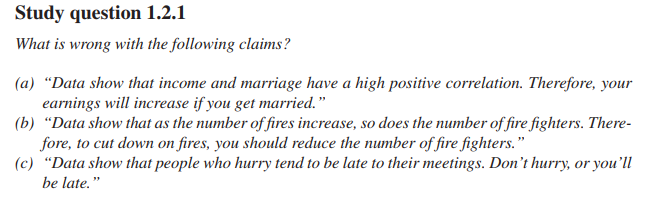
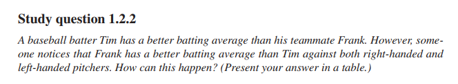
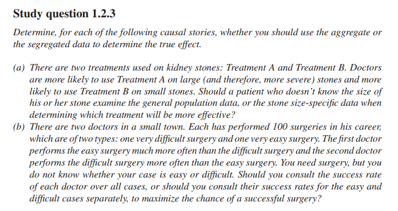
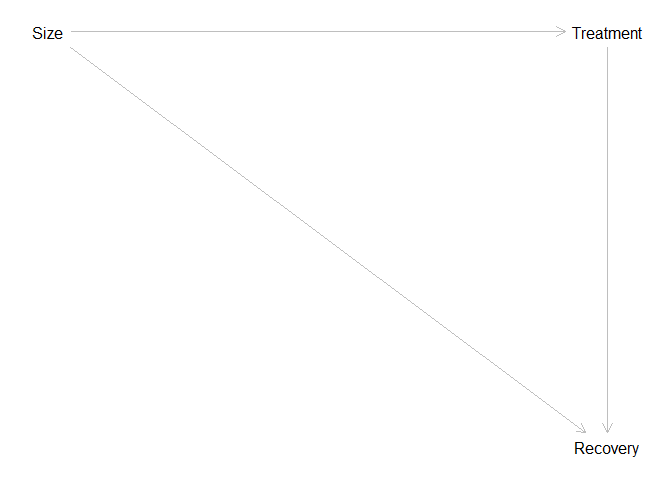
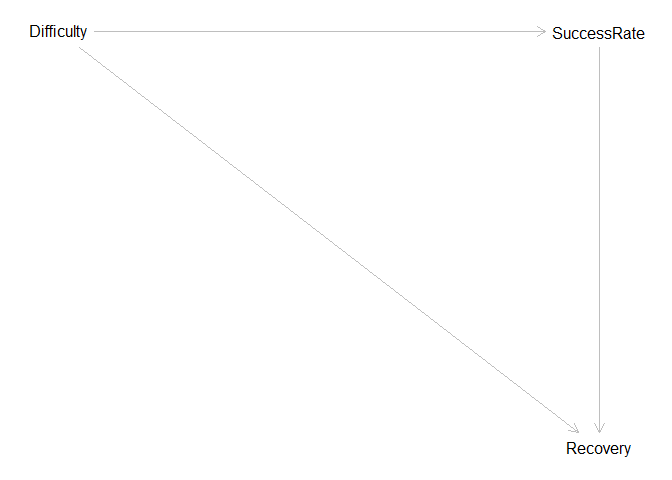
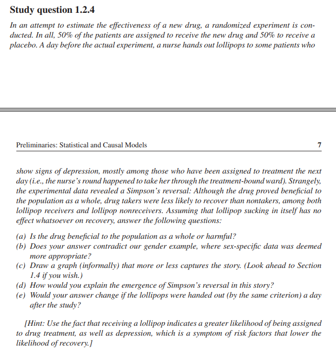
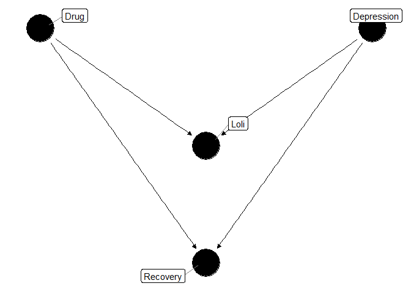

Study questions 1.2
================
João Pedro S. Macalós
2/21/2020

  - [Study questions (chapter 1.2):](#study-questions-chapter-1.2)
      - [1.2.1](#section)
      - [1.2.2](#section-1)
      - [1.2.3](#section-2)
      - [1.2.4](#section-3)
          - [a)](#a)
          - [b)](#b)
          - [c)](#c)
          - [e)](#e)

``` r
library(tidyverse)
library(dagitty)
library(ggdag)
library(pander)
```

``` r
theme_set(theme_dag())
```

# Study questions (chapter 1.2):

## 1.2.1

``` r

```

<!-- -->

Correlation is not causation

## 1.2.2

``` r

```

<!-- -->

Simpson’s paradox.

``` r
tb22 <- tibble(
  id = c('Frank', 'Frank', 'Tim', 'Tim'),
  hand = c('RHS', 'LHS', 'RHS', 'LHS'),
  value = c(81, 192, 234, 55),
  total = c(87, 263, 270, 80)
)
```

``` r
# Grouped by hand
tb22 %>%
  group_by(hand, id) %>%
  summarize(batting_average = value / total)
```

    ## # A tibble: 4 x 3
    ## # Groups:   hand [2]
    ##   hand  id    batting_average
    ##   <chr> <chr>           <dbl>
    ## 1 LHS   Frank           0.730
    ## 2 LHS   Tim             0.688
    ## 3 RHS   Frank           0.931
    ## 4 RHS   Tim             0.867

``` r
# Ungrouped
tb22 %>%
  group_by(id) %>%
  summarize(batting_average = sum(value)/sum(total))
```

    ## # A tibble: 2 x 2
    ##   id    batting_average
    ##   <chr>           <dbl>
    ## 1 Frank           0.78 
    ## 2 Tim             0.826

## 1.2.3

``` r

```

<!-- -->

``` r
g <- dagitty('dag {
    Size [pos="0,0"]
    Treatment [pos="1,0"]
    Recovery [pos="1,1"]
    
    Size -> Treatment -> Recovery
    Size -> Recovery
}')
plot(g)
```

<!-- -->

Both have the above structure. In the first case, you should control for
size because otherwise it leaves open a non-causal relationship between
treatment and recovery.

The same goes for the second question, where “difficulty” takes the
place of the size and the success/rate the treatment:

``` r
g <- dagitty('dag {
    Difficulty [pos="0,0"]
    SuccessRate [pos="1,0"]
    Recovery [pos="1,1"]
    
    Difficulty -> SuccessRate -> Recovery
    Difficulty -> Recovery
}')
plot(g)
```

<!-- -->

## 1.2.4

``` r

```

<!-- -->

#### a)

Yes, the drug is beneficial to the population as a whole.

#### b)

No. In this case, `Lollipop` is a collider and controlling for it opens
a non-causal backdoor path.

#### c)

``` r
coords <- data.frame(matrix(c("L",0.5,0.85,
                              "Dr",0,1,
                              "Dep",1,1,
                              "Rec",0.5,0), nrow=4, ncol=3, byrow=T))
colnames(coords) <- c("name","x","y")

dagify(L ~ Dr, L ~ Dep,
       Rec ~ Dr, Rec ~ Dep,
       labels = c('L' = 'Loli',
                  'Dr' = 'Drug',
                  'Dep' = 'Depression',
                  'Rec' = 'Recovery'),
       coords = coords) %>% 
    ggdag(use_labels = 'label', text = F)
```

<!-- -->

I would explain the emergence of Simpson’s paradox in this example
through the collider bias. By controlling for Loli, the researchers open
a non-causal backdoor path between drug and recovery through depression.

#### e)

I wouldn’t change my answer if the lollipops were handed out a day after
the study. The Lollipops do not mediate the effect of drugs on recovery.
Therefore, they would still lead to bias in the estimation.
