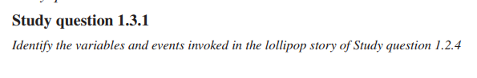
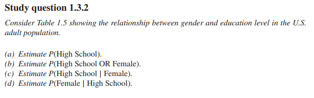
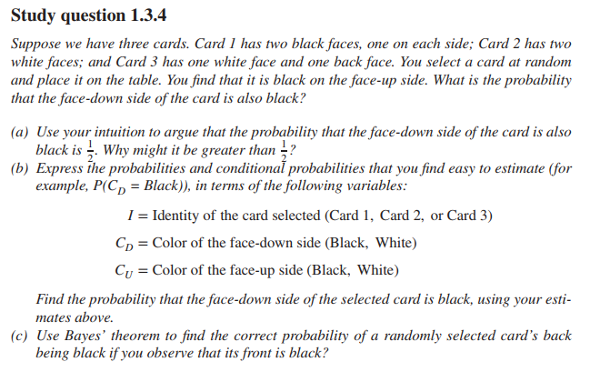
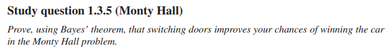
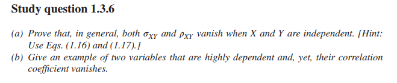
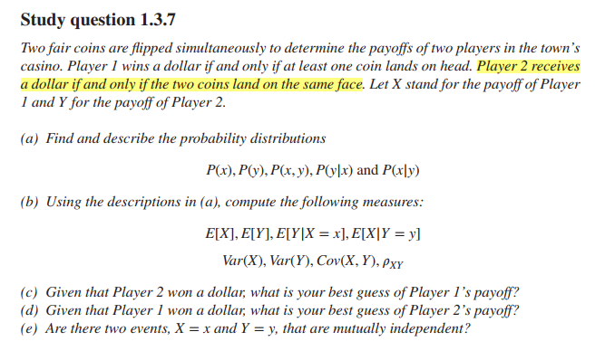
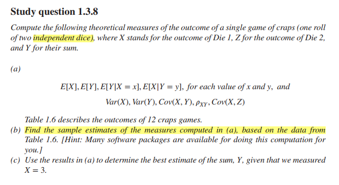
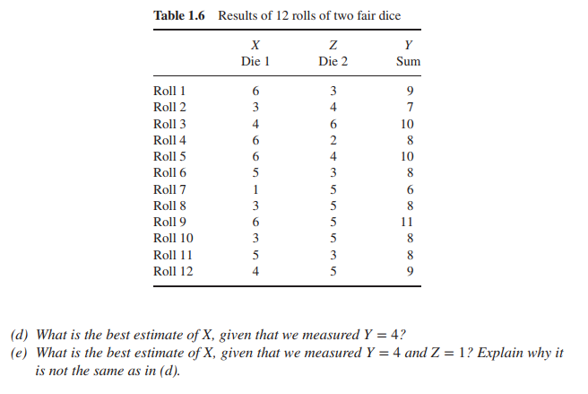
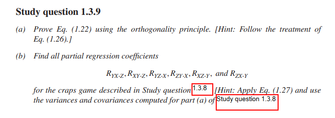

Study questions 1.3
================
João Pedro S. Macalós
2/21/2020

  - [Study questions (chapter 1.3):](#study-questions-chapter-1.3)
      - [1.3.1](#section)
      - [1.3.2](#section-1)
          - [a)](#a)
          - [b)](#b)
          - [c)](#c)
          - [d)](#d)
      - [1.3.3](#section-2)
          - [a)](#a-1)
          - [b)](#b-1)
      - [1.3.4](#section-3)
          - [a)](#a-2)
          - [b)](#b-2)
          - [c)](#c-1)
      - [1.3.5 (Monty Hall)](#monty-hall)
      - [1.3.6](#section-4)
      - [1.3.7](#section-5)
          - [a)](#a-3)
          - [b) Given that player 2 won a dollar, what’s the best guess
            of player 1
            payoff?](#b-given-that-player-2-won-a-dollar-whats-the-best-guess-of-player-1-payoff)
          - [c) Given that player 1 won a dollar, what’s the best guess
            of player 2
            payoff?](#c-given-that-player-1-won-a-dollar-whats-the-best-guess-of-player-2-payoff)
          - [d) Are two events mutually
            independent?](#d-are-two-events-mutually-independent)
      - [1.3.8](#section-6)
          - [a)](#a-4)
          - [b)](#b-3)
          - [c) Use the results in (a) to determinate the best estimate
            of the sum Y if X =
            3](#c-use-the-results-in-a-to-determinate-the-best-estimate-of-the-sum-y-if-x-3)
          - [d) E(X|Y=4)](#d-exy4)
          - [e) E(X|Y=4, Z=1)](#e-exy4-z1)
      - [1.3.9](#section-7)
          - [a)](#a-5)
          - [b)](#b-4)

``` r
library(tidyverse)
library(dagitty)
library(ggdag)
library(pander)
```

``` r
theme_set(theme_dag())
```

# Study questions (chapter 1.3):

## 1.3.1

``` r

```

<!-- -->

``` r
tibble(
  vars = c('Loli', 'Drug', 'Depression', 'Recovery'),
  events = c('yes or no', 'yes or no', 'yes or no', 'yes or no')
) %>%
  mutate(events = str_c(vars, ': ', events))
```

    ## # A tibble: 4 x 2
    ##   vars       events               
    ##   <chr>      <chr>                
    ## 1 Loli       Loli: yes or no      
    ## 2 Drug       Drug: yes or no      
    ## 3 Depression Depression: yes or no
    ## 4 Recovery   Recovery: yes or no

## 1.3.2

``` r

```

<!-- -->

``` r
tb132 <- tibble(
  gender = c('M', 'M', 'M', 'M', 'F', 'F', 'F', 'F'),
  education = c('NFHS', 'HS', 'C', 'GS', 'NFHS', 'HS', 'C', 'GS'),
  ocurrence = c(112, 231, 595, 242, 136, 189, 763, 172)
)

tb132
```

    ## # A tibble: 8 x 3
    ##   gender education ocurrence
    ##   <chr>  <chr>         <dbl>
    ## 1 M      NFHS            112
    ## 2 M      HS              231
    ## 3 M      C               595
    ## 4 M      GS              242
    ## 5 F      NFHS            136
    ## 6 F      HS              189
    ## 7 F      C               763
    ## 8 F      GS              172

#### a)

``` r
tb132 %>%
  #filter(education == 'HS') %>%
  #summarize(p = mean(ocurrence)) %>%
  mutate(total = sum(ocurrence)) %>%
  group_by(education) %>%
  summarize(p = sum(ocurrence)/last(total))
```

    ## # A tibble: 4 x 2
    ##   education     p
    ##   <chr>     <dbl>
    ## 1 C         0.557
    ## 2 GS        0.170
    ## 3 HS        0.172
    ## 4 NFHS      0.102

#### b)

``` r
tb132 %>%
  mutate(no = case_when(gender == 'M' & education == 'HS' ~ ocurrence,
                        gender == 'M' & education != 'HS' ~ 0,
                        T ~ ocurrence)) %>%
  summarize(p = sum(no)/sum(ocurrence))
```

    ## # A tibble: 1 x 1
    ##       p
    ##   <dbl>
    ## 1 0.611

#### c)

``` r
tb132 %>%
  filter(gender == 'F') %>%
  mutate(total = sum(ocurrence)) %>%
  group_by(education) %>%
  summarize(p = sum(ocurrence)/first(total))
```

    ## # A tibble: 4 x 2
    ##   education     p
    ##   <chr>     <dbl>
    ## 1 C         0.606
    ## 2 GS        0.137
    ## 3 HS        0.15 
    ## 4 NFHS      0.108

#### d)

``` r
tb132 %>%
  filter(education == 'HS') %>%
  mutate(total = sum(ocurrence)) %>%
  group_by(gender) %>%
  summarize(p = ocurrence / first(total))
```

    ## # A tibble: 2 x 2
    ##   gender     p
    ##   <chr>  <dbl>
    ## 1 F       0.45
    ## 2 M       0.55

## 1.3.3

#### a)

``` r
# P(11)
p11 <- 1/2 * 1/18 + 1/2 * 1/38

# P(craps|11) balanced
p_craps11 <- (1/18 * 1/2)/p11
p_craps11
```

    ## [1] 0.6785714

``` r
p_craps_1to2 <- (1/18 * 1/3)/p11
p_craps_1to2
```

    ## [1] 0.452381

#### b)

Compute P(‘roulette’|10) assuming twice as many craps.

This one is tricky because there are more than 2 possibilities of 10 in
craps: 5-5 4-6

``` r
# For roulette, p10 = p11
p10 <- 2/3 * 1/9 + 1/3 * 1/38

# P(roulette|10) 2 craps 1 roulette
p_roul_1to2 <- (1/38 * 1/3)/p10
p_roul_1to2
```

    ## [1] 0.1058824

``` r
# P(craps|10)
p_craps_2to1 <- (1/9 * 2/3)/p10
p_craps_2to1
```

    ## [1] 0.8941176

``` r
p_roul_1to2 + p_craps_2to1
```

    ## [1] 1

## 1.3.4

``` r

```

<!-- -->

#### a)

Intuitively: Because if one face is black, you rule out the possibility
of being card2. You’re left with only two possibilities.

However, maybe you should consider card1 twice because it could have
landed in both sides.

#### b)

Base-rates: P(CD = black) = 1/2 P(CD = white) = 1/2

#### c)

Using Bayes’ theorem,

  
 = \\frac{P(A|B)*P(B)}{P(A)}
")  

Our objective is to find ").

We should Bayes’ theorem for that.

The tricky is to find the correct intermediary conditional probability.
To do so, one must count each side of the cards.

``` r
# Black = 1, White = 0

cond_probs <- tribble(
  ~up, ~down,
  1, 1,
  1, 1,
  0, 0,
  0, 0,
  1, 0,
  0, 1
)

cond_probs %>% pander
```

| up | down |
| :-: | :--: |
| 1  |  1   |
| 1  |  1   |
| 0  |  0   |
| 0  |  0   |
| 1  |  0   |
| 0  |  1   |

To find "):

``` r
p_up1_down1 <- cond_probs %>%
  filter(down == 1) %>%
  #summarize(p = mean(up)) # Here we could also use the mean due to the 1 0 coding
  summarize(p = sum(up)/n())

p_base <- 1/2

p_bayes <- (p_up1_down1 * p_base)/p_base
p_bayes
```

    ##           p
    ## 1 0.6666667

## 1.3.5 (Monty Hall)

``` r

```

<!-- -->

This problem is tricky to solve.

Given that the player choose door 1, let’s consider two events: 1. Car
behind door 1; 2. Monty opens door 2.

What’s the probability of this event?

  
 = \\frac{P(Monty = Door2|D1 =car)*P(D1=car)}{P(Monty=Door2)}
")  

We need to calculate three probabilities:

 = 1/2")  = 1/3")

The last one is the difficult one. We must consider that: 1. The player
chose door 1 and Monty opened door 2. Therefore, if: a. Car is behind
door 1: 1/2 chance of opening door 2 (it could as well be in door 3); b.
Car is behind door 2: 0 chances of opening door 2; c. Car is behind door
3: Monty will always open door 2.

Therefore, to find the probability that Monty will open door 2 we must
consider the fact that his choice is not random.

  
 = \\frac{1}{3} * \\frac{1}{2} + \\frac{1}{3} * 0 + \\frac{1}{3} * 1 = \\frac{1}{2}
")  

Thus,

  
 = \\frac{\\frac{1}{2} * \\frac{1}{3}}{\\frac{1}{2}} = \\frac{1}{3}
")  
The probability that the car is behind door 3 is found very similarly.
The denominator and the base rate for  are
the same. Therefore, me must find "). If the car is behind door 3, and the
player already chose D1, Monty will always open door 2, and therefore
its probability is 1.

  
 = \\frac{1*\\frac{1}{3}}{\\frac{1}{2}} = \\frac{2}{3}
")  

credit goes to:
<https://www.statisticshowto.datasciencecentral.com/probability-and-statistics/monty-hall-problem/>

## 1.3.6

``` r

```

<!-- -->

Here, we must prove that if X and Y are independent,
 and
 are equal to zero (in general).

  
![&#10;\\sigma\_{xy} = E\[ (X - E(X))\*(Y -
E(Y))\]&#10;](https://latex.codecogs.com/png.latex?%0A%5Csigma_%7Bxy%7D%20%3D%20E%5B%20%28X%20-%20E%28X%29%29%2A%28Y%20-%20E%28Y%29%29%5D%0A
"
\\sigma_{xy} = E[ (X - E(X))*(Y - E(Y))]
")  

  
 - E(XE(Y)) - E(YE(X)) + E(X)E(Y)
")  
Since the expectation of the expectation is the expectation:   
 - E(X)E(Y) - E(X)E(Y) + E(X)E(Y) = E(XY) - E(X)E(Y)
")  
Now, if two variables are independent, they are also mean independent
(the reverse is not true),   
 = E(X)E(Y)
")  

Therefore,   
E(Y) - E(X)E(Y) = 0
")  

If , it follows that
 will also be zero:

  
  

Check theorem 2 in:
<https://imai.fas.harvard.edu/teaching/files/Expectation.pdf>

## 1.3.7

``` r

```

<!-- -->

#### a)

``` r
tb <- tibble(x = c(1, 1, 1, 0), y = c(1, 0, 0, 1))
```

Probabilities:

``` r
# Probabilities
tb %>%
  summarize_all(mean)
```

    ## # A tibble: 1 x 2
    ##       x     y
    ##   <dbl> <dbl>
    ## 1  0.75   0.5

Conditional probabilities:

``` r
tibble(
  x_y = tb %>%
    filter(y == 1) %>%
    pull(x) %>% mean,
  y_x = tb %>%
    filter(x == 1) %>%
    pull(y) %>% mean
)
```

    ## # A tibble: 1 x 2
    ##     x_y   y_x
    ##   <dbl> <dbl>
    ## 1   0.5 0.333

Variances and covariances:

``` r
3/4 * cov(tb)
```

    ##         x      y
    ## x  0.1875 -0.125
    ## y -0.1250  0.250

``` r
# Multiply by (n-1)/n to get the POPULATION variance and covariance
```

Correlation

``` r
-1/4 / sqrt(3/16)
```

    ## [1] -0.5773503

``` r
cor(tb)
```

    ##            x          y
    ## x  1.0000000 -0.5773503
    ## y -0.5773503  1.0000000

#### b) Given that player 2 won a dollar, what’s the best guess of player 1 payoff?

E(X|y=1) = 1/2

#### c) Given that player 1 won a dollar, what’s the best guess of player 2 payoff?

E(Y|x=1) = 1/3

#### d) Are two events mutually independent?

No

## 1.3.8

``` r

```

<!-- -->

#### a)

``` r
# E(X)
mean(1:6)
```

    ## [1] 3.5

``` r
# E(Y)

tb = tibble(X = rep(1:6, each = 6),
       Z = rep(1:6, 6),
       Y = X + Z
)

tb %>%
  summarize_all(mean)
```

    ## # A tibble: 1 x 3
    ##       X     Z     Y
    ##   <dbl> <dbl> <dbl>
    ## 1   3.5   3.5     7

``` r
# E(Y|X=x)
map_df(1:6, ~summarize_all(filter(tb, X == .x), mean)) %>% summarize(Y = sum(Y))
```

    ## # A tibble: 1 x 1
    ##       Y
    ##   <dbl>
    ## 1    42

``` r
# E(X|y=y)
all_Y <- unique(tb$Y)
map_df(all_Y, ~summarize_all(filter(tb, Y == .x), mean)) %>% summarize(X = sum(X))
```

    ## # A tibble: 1 x 1
    ##       X
    ##   <dbl>
    ## 1  38.5

``` r
# Variances and covariances
35/36 * var(tb)
```

    ##          X        Z        Y
    ## X 2.916667 0.000000 2.916667
    ## Z 0.000000 2.916667 2.916667
    ## Y 2.916667 2.916667 5.833333

``` r
# Variances by hand
tb_sq_sum <- tb %>%
  mutate_at(vars(everything()), list(sq = ~ .^2)) %>%
  mutate_at(vars(contains('sq')), list(~ ./36)) %>%
  summarize_at(vars(contains('sq')), list(~ sum(.)))

# Var(X)
tb_sq_sum$X_sq - 3.5^2
```

    ## [1] 2.916667

``` r
# Var(Y)
tb_sq_sum$Y_sq - 7^2
```

    ## [1] 5.833333

``` r
# Correlation
cor(tb)
```

    ##           X         Z         Y
    ## X 1.0000000 0.0000000 0.7071068
    ## Z 0.0000000 1.0000000 0.7071068
    ## Y 0.7071068 0.7071068 1.0000000

``` r
# By hand (rho xy)
(tb_sq_sum$X_sq - 3.5^2) / (sqrt(tb_sq_sum$X_sq - 3.5^2) * sqrt(tb_sq_sum$Y_sq - 7^2))
```

    ## [1] 0.7071068

``` r
# Cov(X, Z) Above
```

``` r

```

<!-- -->

#### b)

``` r
tba <- tibble(
  X = c(6, 3, 4, 6, 6, 5, 1, 3, 6, 3, 5, 4),
  Z = c(3, 4, 6, 2, 4, 3, 5, 5, 5, 5, 3, 5)
) %>%
  mutate(
    Y = X + Z
  )

tba
```

    ## # A tibble: 12 x 3
    ##        X     Z     Y
    ##    <dbl> <dbl> <dbl>
    ##  1     6     3     9
    ##  2     3     4     7
    ##  3     4     6    10
    ##  4     6     2     8
    ##  5     6     4    10
    ##  6     5     3     8
    ##  7     1     5     6
    ##  8     3     5     8
    ##  9     6     5    11
    ## 10     3     5     8
    ## 11     5     3     8
    ## 12     4     5     9

Find the sample estimates:

``` r
# Means
tba %>%
  summarize_all(mean)
```

    ## # A tibble: 1 x 3
    ##       X     Z     Y
    ##   <dbl> <dbl> <dbl>
    ## 1  4.33  4.17   8.5

``` r
# Conditional means
# E(Y|x=x)
Y <- map_df(1:6, ~summarize_all(filter(tb, X == .x), mean)) %>% summarize(Y = sum(Y))

# E(X|y=y)
X <- map_df(unique(tba$Y), ~summarize_all(filter(tb, Y == .x), mean)) %>% summarize(X = sum(X))

bind_cols(Y, X)
```

    ## # A tibble: 1 x 2
    ##       Y     X
    ##   <dbl> <dbl>
    ## 1    42  25.5

``` r
# Sample variances and covariances
var(tba)
```

    ##           X          Z         Y
    ## X  2.606061 -1.0606061 1.5454545
    ## Z -1.060606  1.4242424 0.3636364
    ## Y  1.545455  0.3636364 1.9090909

#### c) Use the results in (a) to determinate the best estimate of the sum Y if X = 3

``` r
tb %>%
  filter(X == 3) %>%
  summarize(Y = mean(Y))
```

    ## # A tibble: 1 x 1
    ##       Y
    ##   <dbl>
    ## 1   6.5

#### d) E(X|Y=4)

``` r
tb %>%
  filter(Y == 4) %>%
  summarize(X = mean(X))
```

    ## # A tibble: 1 x 1
    ##       X
    ##   <dbl>
    ## 1     2

#### e) E(X|Y=4, Z=1)

``` r
tb %>%
  filter(Y == 4,
         Z == 1) %>%
  summarize(X = mean(X))
```

    ## # A tibble: 1 x 1
    ##       X
    ##   <dbl>
    ## 1     3

The results are not the same because we are filtering out more results.
Instead of considering the six possible values when Y == 4, we must also
filter out all of the values among those six in which Z is different
than 1.

## 1.3.9

``` r

```

<!-- -->

#### a)

Equation 1.22 (adapted for the Ys and Xs in the question):   
  

  
 = \\alpha + \\beta E(Y)
")  
  
 = \\alpha E(Y) + \\beta E(Y^2) + E(Y*\\epsilon)
")  

The orthogonality principle dictates that *\\epsilon = 0"). Thus

  
 - \\beta E(Y^2)}{E(Y)}
")  

  
 = \\frac{E(XY) - \\beta E(Y^2)}{E(Y)} + \\beta E(Y) 
")  

  
 - \\frac{E(XY) - \\beta E(Y^2)}{E(Y)} = \\beta E(Y)
")  

  
E(Y) - E(XY) + \\beta E(Y^2)}{E(Y)} = \\beta E(Y)
")  

  
^2 = E(X)E(Y) - E(XY) + \\beta E(Y^2)
")  

  
^2 - E(Y^2)) = E(X)E(Y) - E(XY)
")  

  
E(Y) - E(XY)}{E(Y)^2 - E(Y^2)}
")  

Multiply the RHS by -1/-1:

  
- E(X)E(Y)}{E(Y^2) - E(Y)^2}
")  

Since  = E(Y^2) - E(Y)^2") and  = E(XY) - E(X)E(Y)"),

  
  

#### b)

Formula:

  
  

``` r
# Remember variances tb
var_tb <- 35/36 * var(tb)
```

Examples using the
 terminology:

  
  

  
  

To find 

``` r
var_tb
```

    ##          X        Z        Y
    ## X 2.916667 0.000000 2.916667
    ## Z 0.000000 2.916667 2.916667
    ## Y 2.916667 2.916667 5.833333

``` r
(var_tb[2,2]*var_tb[3,1] - var_tb[3,2]*var_tb[2,1]) / 
  (var_tb[1,1]*var_tb[2,2] - var_tb[2,1]^2)
```

    ## [1] 1

Knowing the data generating process, i.e., Y = X + Z,

We expect that:

     

``` r
lm(Y ~ X + Z, data = tb) %>% coefficients
```

    ##  (Intercept)            X            Z 
    ## 5.921189e-16 1.000000e+00 1.000000e+00

``` r
lm(X ~ Y + Z, data = tb) %>% coefficients
```

    ##   (Intercept)             Y             Z 
    ## -5.921189e-15  1.000000e+00 -1.000000e+00

``` r
lm(Z ~ Y + X, data = tb) %>% coefficients
```

    ##   (Intercept)             Y             X 
    ## -5.921189e-15  1.000000e+00 -1.000000e+00
