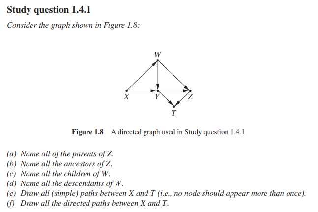
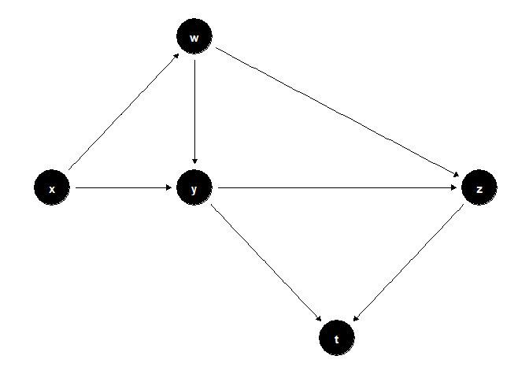
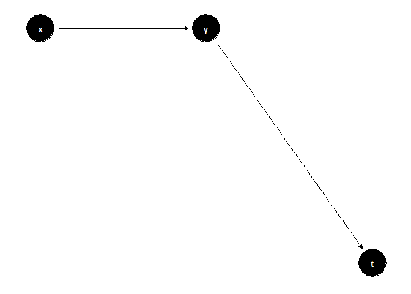
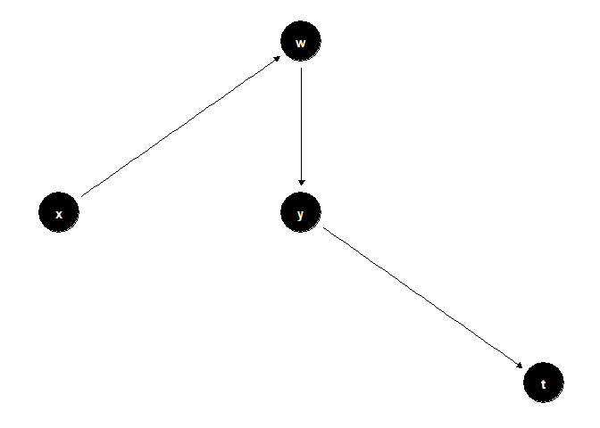
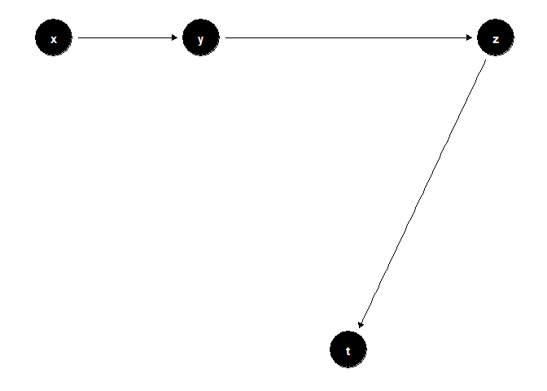
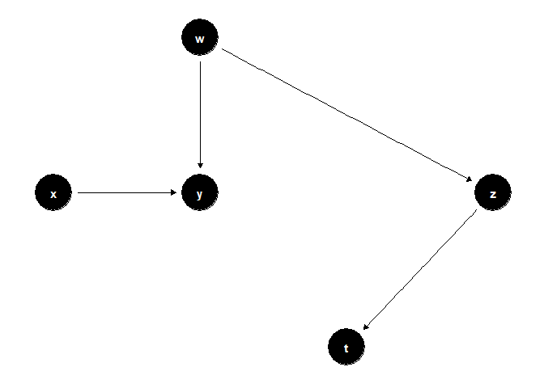
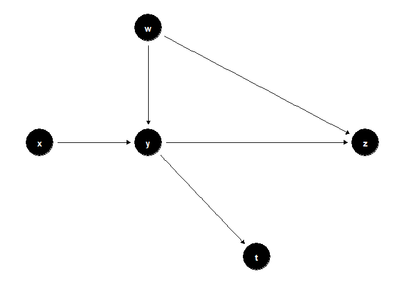

Study questions 1.4
================
João Pedro S. Macalós
2/21/2020

  - [Study questions (chapter 1.4):](#study-questions-chapter-1.4)
      - [1.4.1](#section)
          - [e)](#e)
          - [f)](#f)

``` r
library(tidyverse)
library(dagitty)
library(ggdag)
library(pander)
```

``` r
theme_set(theme_dag())
```

# Study questions (chapter 1.4):

## 1.4.1

``` r

```

<!-- -->

1)  Y and W
2)  Y, W and X
3)  Z and Y
4)  Y, Z and T

#### e)

``` r
coords <- data.frame(matrix(c(
  'x', 1, 1,
  'w', 2, 2,
  'y', 2, 1,
  'z', 2.5, 1,
  't', 2.25, 0.5), nrow = 5, ncol = 3, byrow = T))
colnames(coords) <- c("name","x","y")

dagify(w ~ x,
      y ~ x, y ~ w,
      z ~ w, z ~ y,
      t ~ y, t ~ z,
      coords = coords) %>%
 ggdag()
```

<!-- -->

``` r
# dagify(w ~ t,
#        y ~ t, y ~ w,
#        z ~ w, z ~ y,
#        t ~ y, t ~ z
#        ) %>%
#   ggdag()
```

``` r
coords <- data.frame(matrix(c(
  'x', 1, 1,
  'y', 2, 1,
  't', 2.25, 0.5), nrow = 5, ncol = 3, byrow = T))
```

    ## Warning in matrix(c("x", 1, 1, "y", 2, 1, "t", 2.25, 0.5), nrow = 5, ncol = 3, :
    ## data length [9] is not a sub-multiple or multiple of the number of rows [5]

``` r
colnames(coords) <- c("name","x","y")

dagify(y ~ x,
      t ~ y,
      coords = coords) %>%
 ggdag()
```

<!-- -->

``` r
coords <- data.frame(matrix(c(
  'x', 1, 1,
  'w', 2, 2,
  'y', 2, 1,
  't', 2.25, 0.5), nrow = 5, ncol = 3, byrow = T))
```

    ## Warning in matrix(c("x", 1, 1, "w", 2, 2, "y", 2, 1, "t", 2.25, 0.5), nrow =
    ## 5, : data length [12] is not a sub-multiple or multiple of the number of rows
    ## [5]

``` r
colnames(coords) <- c("name","x","y")

dagify(w ~ x,
      y ~ w,
      t ~ y,
      coords = coords) %>%
 ggdag()
```

<!-- -->

``` r
coords <- data.frame(matrix(c(
  'x', 1, 1,
  'y', 2, 1,
  'z', 2.5, 1,
  't', 2.25, 0.5), nrow = 4, ncol = 3, byrow = T))
colnames(coords) <- c("name","x","y")

dagify(y ~ x,
       z ~ y,
       t ~ z,
      coords = coords) %>%
 ggdag()
```

<!-- -->

``` r
coords <- data.frame(matrix(c(
  'x', 1, 1,
  'w', 2, 2,
  'y', 2, 1,
  'z', 2.5, 1,
  't', 2.25, 0.5), nrow = 5, ncol = 3, byrow = T))
colnames(coords) <- c("name","x","y")

dagify(y ~ x, 
       y ~ w,
       z ~ w,
       t ~ z,
      coords = coords) %>%
 ggdag()
```

<!-- -->

``` r
# dagify(w ~ t,
#        y ~ t, y ~ w,
#        z ~ w, z ~ y,
#        t ~ y, t ~ z
#        ) %>%
#   ggdag()
```

``` r
coords <- data.frame(matrix(c(
  'x', 1, 1,
  'w', 2, 2,
  'y', 2, 1,
  'z', 2.5, 1,
  't', 2.25, 0.5), nrow = 5, ncol = 3, byrow = T))
colnames(coords) <- c("name","x","y")

dagify(y ~ x, 
       y ~ w,
       z ~ w,
       z ~ y,
       t ~ y,
      coords = coords) %>%
 ggdag()
```

<!-- -->

``` r
# dagify(w ~ t,
#        y ~ t, y ~ w,
#        z ~ w, z ~ y,
#        t ~ y, t ~ z
#        ) %>%
#   ggdag()
```

#### f)

All the simple paths with the exception of the last two ones
