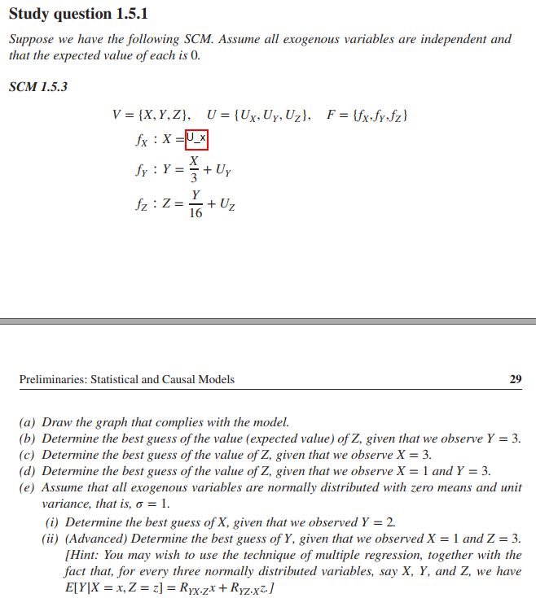
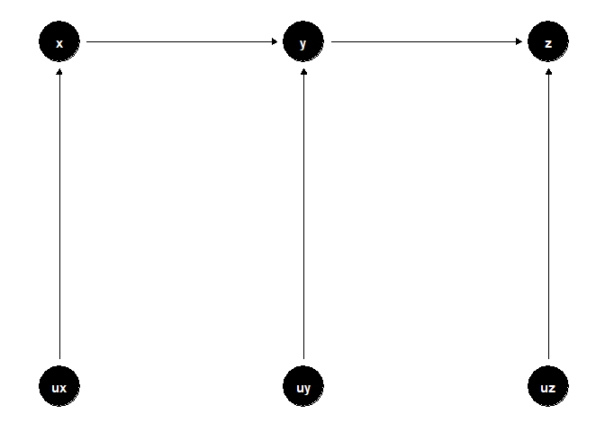
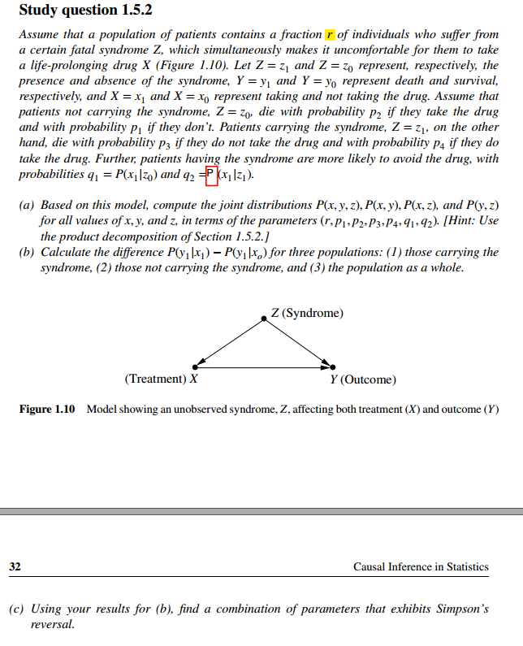
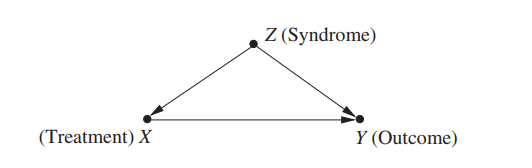
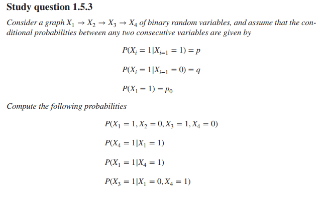
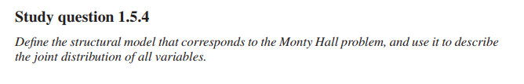

Study questions 1.5
================
João Pedro S. Macalós
2/21/2020

  - [Study questions (chapter 1.5):](#study-questions-chapter-1.5)
      - [1.5.1](#section)
          - [a)](#a)
          - [b)](#b)
          - [c)](#c)
          - [d)](#d)
          - [e)](#e)
      - [1.5.2](#section-1)
          - [a)](#a-1)
          - [b)](#b-1)
          - [c)](#c-1)
      - [1.5.3](#section-2)
          - [a)](#a-2)
          - [b)](#b-2)
          - [c)](#c-2)
          - [d)](#d-1)
      - [1.5.4](#section-3)
          - [a)](#a-3)
          - [b)](#b-3)

``` r
library(tidyverse)
library(dagitty)
library(ggdag)
library(pander)
```

``` r
theme_set(theme_dag())
```

# Study questions (chapter 1.5):

## 1.5.1

``` r

```

<!-- -->

#### a)

``` r
coords <- tribble(
  ~name, ~x, ~y,
  'x', 1, 3,
  'y', 2, 3,
  'z', 3, 3,
  'ux', 1, 1,
  'uy', 2, 1,
  'uz', 3, 1
)

dagify(x ~ ux,
       y ~ x, y ~ uy,
       z ~ y, z ~ uz,
       coords = coords) %>%
  ggdag()
```

<!-- -->

#### b)

``` r
3/16
```

    ## [1] 0.1875

#### c)

``` r
Y = 3/3
Z = Y/16
Z # 1/16
```

    ## [1] 0.0625

#### d)

``` r
#X = 1 We can safely ignore X in this case.
Y = 3
Z = Y/16
Z
```

    ## [1] 0.1875

#### e)

We can use Y to find X – they are correlated to each other.

  
  

``` r
Y = 2
X = 3*Y
X
```

    ## [1] 6

2)  
<!-- end list -->

``` r
N <- 10000 # sample size
Ux <- rnorm( N ); Uy <- rnorm( N ); Uz <- rnorm( N )
X <- Ux
Y <- 1/3*X + Uy
Z <- (1/16)*Y + Uz
d <- data.frame(X=X,Y=Y,Z=Z)
```

I don’t understand why the coefficients are so similar.

``` r
lm(Y ~ Z, d)
```

    ## 
    ## Call:
    ## lm(formula = Y ~ Z, data = d)
    ## 
    ## Coefficients:
    ## (Intercept)            Z  
    ##    0.001435     0.053889

``` r
lm(Z ~ Y, d)
```

    ## 
    ## Call:
    ## lm(formula = Z ~ Y, data = d)
    ## 
    ## Coefficients:
    ## (Intercept)            Y  
    ##   -0.008385     0.049361

``` r
varcov <- var(d)
varcov
```

    ##            X          Y          Z
    ## X 1.00605655 0.33940711 0.02472311
    ## Y 0.33940711 1.09216887 0.05391028
    ## Z 0.02472311 0.05391028 1.00039456

``` r
# Ryxz = sigma^2_z * sigma_yx - simga_yz * sigma_xz / sigma^2_x * sigma^2_z - sigma^2_xz

Ryxz <- (varcov[3,3] * varcov[2,1] - varcov[2, 3] * varcov[1,3]) /
  (varcov[1, 1] * varcov[3, 3] - varcov[1, 3]^2)

Ryxz
```

    ## [1] 0.3362438

``` r
Ryzx <- (varcov[1,1] * varcov[2, 3] - varcov[1, 2] * varcov[1, 3]) /
  (varcov[1, 1] * varcov[3, 3] - varcov[1, 3]^2)
Ryzx
```

    ## [1] 0.04557931

``` r
Rzyx <- (varcov[1,1] * varcov[3,2] - varcov[3,1] * varcov[1,2]) /
  (varcov[2,2] * varcov[1,1] - varcov[1,2]^2)
Rzyx
```

    ## [1] 0.04661064

``` r
# E[Y|X = 1, Z = 3] = Ryxz * x + Ryzx * z

Ryxz * 1 + Ryzx * 3
```

    ## [1] 0.4729817

``` r
predict(lm(Y~X+Z,d),list(X=1,Z=3),interval="confidence")
```

    ##        fit       lwr       upr
    ## 1 0.476755 0.4127892 0.5407209

## 1.5.2

``` r

```

<!-- -->

#### a)

Given the SCM, we know that:

  
 = P(y|x,z) \\cdot P(x|z) \\cdot P(z)
")  

To answer this question, we have to first express the probabilities:

``` r
tb_z = tribble(~z, ~prob,
               'z0', '1-r',
               'z1', 'r')

tb_x = tribble(~x, ~prob,
               'x1|z0', 'q1',
               'x1|z1', 'q2',
               'x0|z0', '1-q1',
               'x0|z1', '1-q2')

tb_y = tribble(~y, ~prob,
               'y1|x0,z0', 'p1',
               'y1|x1,z0', 'p2',
               'y1|x0,z1', 'p3',
               'y1|x1,z1', 'p4',
               'y0|x0,z0', '1-p1',
               'y0|x1,z0', '1-p2',
               'y0|x0,z1', '1-p3',
               'y0|x1,z1', '1-p4')
```

`tb_y` gives all the possible combinations. Thus we start from there:

``` r
bind_rows(tb_y[1,] %>% bind_cols
          (tb_x[3,], tb_z[1,]),
          tb_y[2,] %>% bind_cols(tb_x[1,], tb_z[1,]),
          tb_y[3,] %>% bind_cols(tb_x[4,], tb_z[2,]),
          tb_y[4,] %>% bind_cols(tb_x[2,], tb_z[2,]),
          tb_y[5,] %>% bind_cols(tb_x[3,], tb_z[1,]),
          tb_y[6,] %>% bind_cols(tb_x[1,], tb_z[1,]),
          tb_y[7,] %>% bind_cols(tb_x[4,], tb_z[2,]),
          tb_y[8,] %>% bind_cols(tb_x[2,], tb_z[2,])
) %>%
  #select(y, x, z, everything()) %>%
  mutate(probability = str_c('P(', y, ').P(', x, ').P(',z,')')) %>%
  unite(outcome, c(prob, prob1, prob2), sep = ' * ') %>%
  select(probability, outcome)
```

    ## # A tibble: 8 x 2
    ##   probability                outcome          
    ##   <chr>                      <chr>            
    ## 1 P(y1|x0,z0).P(x0|z0).P(z0) p1 * 1-q1 * 1-r  
    ## 2 P(y1|x1,z0).P(x1|z0).P(z0) p2 * q1 * 1-r    
    ## 3 P(y1|x0,z1).P(x0|z1).P(z1) p3 * 1-q2 * r    
    ## 4 P(y1|x1,z1).P(x1|z1).P(z1) p4 * q2 * r      
    ## 5 P(y0|x0,z0).P(x0|z0).P(z0) 1-p1 * 1-q1 * 1-r
    ## 6 P(y0|x1,z0).P(x1|z0).P(z0) 1-p2 * q1 * 1-r  
    ## 7 P(y0|x0,z1).P(x0|z1).P(z1) 1-p3 * 1-q2 * r  
    ## 8 P(y0|x1,z1).P(x1|z1).P(z1) 1-p4 * q2 * r

#### b)

Calculate  - P(y_1|x_0)") for three populations: 1) carrying the
syndrome; 2) not carrying the syndrome; and 3) the population as a
whole.

1.  For Z1:   
     - P(y_1|x_0,z_1) = p4 - p3
")  
2.  For Z0:   
     - P(y_1|x_0,z_0) = p2 - p1
")  
3.  For Z:   
     =\\frac{P(y_1, x_1, z)}{P(x_1, z)} = \\frac{\\sum_z P(y1|x1,z) \\cdot P(x1|z) \\cdot P(z)}{\\sum_z P(x_1|z) \\cdot P(z)}
")  

  
 = \\frac{\\sum_z P(y1|x1,z) \\cdot P(x1|z) \\cdot P(z)}{\\sum_z P(x_1|z) \\cdot P(z)} = 
\\frac{p2 \\cdot q1 \\cdot (1-r) + p4 \\cdot q2 \\cdot r}{q1 \\cdot (1-r) + q2 \\cdot r}
")  

  
 = \\frac{P(y_1, x_0, z)}{P(x_0, z)} = \\frac{\\sum_z P(y1|x0,z) \\cdot P(x0|z) \\cdot P(z)}{\\sum_z P(x0|z) \\cdot P(z)}
")  

  
 = \\frac{\\sum_z P(y1|x0,z) \\cdot P(x0|z) \\cdot P(z)}{\\sum_z P(x0|z) \\cdot P(z)} =
\\frac{p1 \\cdot (1-q1) \\cdot (1-r) + p3 \\cdot (1-q2) \\cdot r}{(1-q1) \\cdot (1-r) + (1-q2) \\cdot r}
")  
The answer then is:

  
 + p4 \\cdot q2 \\cdot r}{q1 \\cdot (1-r) + q2 \\cdot r} -
\\frac{p1 \\cdot (1-q1) \\cdot (1-r) + p3 \\cdot (1-q2) \\cdot r}{(1-q1) \\cdot (1-r) + (1-q2) \\cdot r}
")  

#### c)

``` r

```

<!-- -->

To find a combination of parameters that exhibits Simpson’s reversal, it
is useful to look at the section 1.2 of the book. The causal model
displayed in the question is similar to the treatment affected by gender
in that section. In other words, we have here that the syndrome Z is a
cofounder between the outcome and the treatment.

To generate the data showing the Simpson’s reversal, we must adjust the
proportions to have much more people with the syndrome – who die more
often – having the treatment than people without the treatment.

``` r
simpsons <- tibble(id = 1:1000) %>%
  mutate(syn = sample(c(F, T), size = 1000, replace = T, prob = c(.8, .2))) %>%
  mutate(drug = case_when(syn == F ~ sample(c(F, T), size = length(.$syn == F), replace = T, prob = c(.8, .2)),
                          syn == T ~ sample(c(F, T), size = length(.$syn == T), replace = T, prob = c(.3, .7)))) %>%
  mutate(die = case_when(syn == F & drug == T ~ sample(c(F, T), size = length(.$syn == F & .$drug == T), replace = T, prob = c(.9, .1)),
                         syn == F & drug == F ~ sample(c(F, T), size = length(.$syn == F & .$drug == F), replace = T, prob = c(.9, .1)),
                         syn == T & drug == T ~ sample(c(F, T), size = length(.$syn == T & .$drug == T), replace = T, prob = c(.6, .4)),
                         syn == T & drug == F ~ sample(c(F, T), size = length(.$syn == T & .$drug == F), replace = T, prob = c(.2, .8))))
```

Check the death rate among people taking the drug:

``` r
simpsons %>%
  group_by(drug) %>%
  summarize(die = mean(die))
```

    ## # A tibble: 2 x 2
    ##   drug    die
    ##   <lgl> <dbl>
    ## 1 FALSE 0.163
    ## 2 TRUE  0.206

Check the death rate among people taking the drug, stratified by having
the syndrom:

``` r
simpsons %>%
  group_by(syn, drug) %>%
  summarize(die = mean(die))
```

    ## # A tibble: 4 x 3
    ## # Groups:   syn [2]
    ##   syn   drug     die
    ##   <lgl> <lgl>  <dbl>
    ## 1 FALSE FALSE 0.0998
    ## 2 FALSE TRUE  0.112 
    ## 3 TRUE  FALSE 0.845 
    ## 4 TRUE  TRUE  0.317

This dataset exhibits Simpson’s paradox since in the population as whole
the death rate among people taking the drug is higher than in people not
taking it. However, when we stratify by the syndrom, taking the drug is
associated with lower death rates.

## 1.5.3

``` r

```

<!-- -->

#### a)

  
 &= 
P(x_4=0|x_3=1) \\cdot P(x_3=1|x_2=0) \\cdot P(x_2=0|x_1=1)\\cdot P(x_1=1) \\\\ \\\\
&= (1-p) \\cdot q \\cdot (1-p) \\cdot p0 
\\end{aligned}
")  

#### b)

  
 &= \\frac{\\sum_{x_2,x_3} P(x_4=1|x_3) \\cdot P(x_3|x_2) \\cdot P(x_2|x_1=1) \\cdot P(x_1=1)}{P(X_1=1)}
\\end{aligned}
")  

  
![&#10;\\begin{aligned}&#10;& \\sum\_{x\_2, x\_3} P(x\_4 = 1 |x\_3)
\\cdot P(x\_3|x\_2) \\cdot P(x\_2|x\_1 =1) \\cdot P(x\_1 = 1) = \\\\
\\\\&#10;x\_2 = 0, x\_3 = 0 &: \\;\\; P(x\_4=1|x\_3=0) \\cdot
P(x\_3=0|x\_2=0) \\cdot P(x\_2=0|x\_1=1) \\cdot P(x\_1=1) + \\\\&#10;&=
q \\cdot (1-q) \\cdot (1-p) \\cdot p0 + \\\\ \\\\&#10;x\_2 = 0, x\_3 = 1
&: \\;\\; P(x\_4=1|x\_3=1) \\cdot P(x\_3=1|x\_2=0) \\cdot
P(x\_2=0|x\_1=1) \\cdot P(x\_1=1) + \\\\&#10;&= p \\cdot q \\cdot (1-p)
\\cdot p0 + \\\\ \\\\&#10;x\_2 = 1, x\_3 = 0 &: \\;\\; P(x\_4=1|x\_3=0)
\\cdot P(x\_3=0|x\_2=1) \\cdot P(x\_2=1|x\_1=1) \\cdot P(x\_1=1) +
\\\\&#10;&= q \\cdot (1-p) \\cdot p \\cdot p0 + \\\\ \\\\&#10;x\_2 = 1,
x\_3 = 1 &: \\;\\; P(x\_4=1|x\_3=1) \\cdot P(x\_3=1|x\_2=1) \\cdot
P(x\_2=1|x\_1=1) \\cdot P(x\_1=1) + \\\\&#10;&= p \\cdot p \\cdot p
\\cdot
p0&#10;\\end{aligned}&#10;](https://latex.codecogs.com/png.latex?%0A%5Cbegin%7Baligned%7D%0A%26%20%5Csum_%7Bx_2%2C%20x_3%7D%20P%28x_4%20%3D%201%20%7Cx_3%29%20%5Ccdot%20P%28x_3%7Cx_2%29%20%5Ccdot%20P%28x_2%7Cx_1%20%3D1%29%20%5Ccdot%20P%28x_1%20%3D%201%29%20%3D%20%5C%5C%20%5C%5C%0Ax_2%20%3D%200%2C%20x_3%20%3D%200%20%26%3A%20%5C%3B%5C%3B%20P%28x_4%3D1%7Cx_3%3D0%29%20%5Ccdot%20P%28x_3%3D0%7Cx_2%3D0%29%20%5Ccdot%20P%28x_2%3D0%7Cx_1%3D1%29%20%5Ccdot%20P%28x_1%3D1%29%20%2B%20%5C%5C%0A%26%3D%20q%20%5Ccdot%20%281-q%29%20%5Ccdot%20%281-p%29%20%5Ccdot%20p0%20%2B%20%5C%5C%20%5C%5C%0Ax_2%20%3D%200%2C%20x_3%20%3D%201%20%26%3A%20%5C%3B%5C%3B%20P%28x_4%3D1%7Cx_3%3D1%29%20%5Ccdot%20P%28x_3%3D1%7Cx_2%3D0%29%20%5Ccdot%20P%28x_2%3D0%7Cx_1%3D1%29%20%5Ccdot%20P%28x_1%3D1%29%20%2B%20%5C%5C%0A%26%3D%20p%20%5Ccdot%20q%20%5Ccdot%20%281-p%29%20%5Ccdot%20p0%20%2B%20%5C%5C%20%5C%5C%0Ax_2%20%3D%201%2C%20x_3%20%3D%200%20%26%3A%20%5C%3B%5C%3B%20P%28x_4%3D1%7Cx_3%3D0%29%20%5Ccdot%20P%28x_3%3D0%7Cx_2%3D1%29%20%5Ccdot%20P%28x_2%3D1%7Cx_1%3D1%29%20%5Ccdot%20P%28x_1%3D1%29%20%2B%20%5C%5C%0A%26%3D%20q%20%5Ccdot%20%281-p%29%20%5Ccdot%20p%20%5Ccdot%20p0%20%2B%20%5C%5C%20%5C%5C%0Ax_2%20%3D%201%2C%20x_3%20%3D%201%20%26%3A%20%5C%3B%5C%3B%20P%28x_4%3D1%7Cx_3%3D1%29%20%5Ccdot%20P%28x_3%3D1%7Cx_2%3D1%29%20%5Ccdot%20P%28x_2%3D1%7Cx_1%3D1%29%20%5Ccdot%20P%28x_1%3D1%29%20%2B%20%5C%5C%0A%26%3D%20p%20%5Ccdot%20p%20%5Ccdot%20p%20%5Ccdot%20p0%0A%5Cend%7Baligned%7D%0A
"
\\begin{aligned}
& \\sum_{x_2, x_3} P(x_4 = 1 |x_3) \\cdot P(x_3|x_2) \\cdot P(x_2|x_1 =1) \\cdot P(x_1 = 1) = \\\\ \\\\
x_2 = 0, x_3 = 0 &: \\;\\; P(x_4=1|x_3=0) \\cdot P(x_3=0|x_2=0) \\cdot P(x_2=0|x_1=1) \\cdot P(x_1=1) + \\\\
&= q \\cdot (1-q) \\cdot (1-p) \\cdot p0 + \\\\ \\\\
x_2 = 0, x_3 = 1 &: \\;\\; P(x_4=1|x_3=1) \\cdot P(x_3=1|x_2=0) \\cdot P(x_2=0|x_1=1) \\cdot P(x_1=1) + \\\\
&= p \\cdot q \\cdot (1-p) \\cdot p0 + \\\\ \\\\
x_2 = 1, x_3 = 0 &: \\;\\; P(x_4=1|x_3=0) \\cdot P(x_3=0|x_2=1) \\cdot P(x_2=1|x_1=1) \\cdot P(x_1=1) + \\\\
&= q \\cdot (1-p) \\cdot p \\cdot p0 + \\\\ \\\\
x_2 = 1, x_3 = 1 &: \\;\\; P(x_4=1|x_3=1) \\cdot P(x_3=1|x_2=1) \\cdot P(x_2=1|x_1=1) \\cdot P(x_1=1) + \\\\
&= p \\cdot p \\cdot p \\cdot p0
\\end{aligned}
")  

  
 = \\frac{q \\cdot (1-q) \\cdot (1-p) \\cdot p0 + \\\\ 
p \\cdot q \\cdot (1-p) \\cdot p0 + \\\\
q \\cdot (1-p) \\cdot p \\cdot p0 + \\\\
p \\cdot p \\cdot p \\cdot p0}{p0}
")  

#### c)

  

")  
To find this one we should use Bayes rule:

  
 = \\frac{P(x_4 = 1 | x_1 = 1) \\cdot P(x_1 = 1)}{P(x_4 = 1)}
")  

Using the results from the previous question:

  
 = \\frac{\\frac{q \\cdot (1-q) \\cdot (1-p) \\cdot p0 + \\\\ 
p \\cdot q \\cdot (1-p) \\cdot p0 + \\\\
q \\cdot (1-p) \\cdot p \\cdot p0 + \\\\
p \\cdot p \\cdot p \\cdot p0}{p0
} \\cdot p0}{P(x_4 = 1)}
")  

To find the denominator, we take advantage from the fact that (and we
simplify the notation):

  
 &= P(x_4 = 1 | x_1 = 1) + P(x_4 = 1 | x_1 = 0) \\\\ \\\\
&= \\omega + \\delta
\\end{aligned}
")  
We then replace  for
"):

  
 = 
\\frac{q \\cdot (1-q) \\cdot (1-p) \\cdot (1-p0) + \\\\
p \\cdot q \\cdot (1-p) \\cdot (1-p0) + \\\\
q \\cdot (1-p) \\cdot p \\cdot (1-p0) + \\\\
p \\cdot p \\cdot p \\cdot (1-p0)}{(1-p0)}
")  

  
 = \\frac{\\omega \\cdot p0}{\\omega + \\delta}
")  

#### d)

  
 &= \\frac{\\sum_{x2} P(x_4 = 1, x_3 = 1, x2, x1 = 0)}{P(x_1 = 0, x_4 = 1)}
\\end{aligned}
")  

Solving first the numerator
():

  
 \\cdot P(x_3=1|x_2=0) \\cdot P(x_2=0|x_1=0) \\cdot P(x_1=0) \\; + \\\\ \\\\
x_2 = 1 &: \\;\\; P(x_4=1|x_3=1) \\cdot P(x_3=1|x_2=1) \\cdot P(x_2=1|x_1=0) \\cdot P(x_1=0) \\\\ \\\\
&= p \\cdot q \\cdot (1-q) \\cdot (1-p0) + p \\cdot p \\cdot q \\cdot (1-p0) 
\\end{aligned}
")  

Solving the denominator
():

  
![&#10;\\begin{aligned}&#10;P(X\_1 = 0, x\_4 = 1) &= \\\\ \\\\&#10;x\_2
= 0, x\_3 = 0 &: \\;\\; P(x\_4=1|x\_3=0) \\cdot P(x\_3=0|x\_2=0) \\cdot
P(x\_2=0|x\_1=0) \\cdot P(x\_1=0) + \\\\ \\\\&#10;x\_2 = 0, x\_3 = 1 &:
\\;\\; P(x\_4=1|x\_3=1) \\cdot P(x\_3=1|x\_2=0) \\cdot P(x\_2=0|x\_1=0)
\\cdot P(x\_1=0) + \\\\ \\\\&#10;x\_2 = 1, x\_3 = 0 &: \\;\\;
P(x\_4=1|x\_3=0) \\cdot P(x\_3=0|x\_2=1) \\cdot P(x\_2=1|x\_1=0) \\cdot
P(x\_1=0) + \\\\ \\\\&#10;x\_2 = 1, x\_3 = 1 &: \\;\\; P(x\_4=1|x\_3=1)
\\cdot P(x\_3=1|x\_2=1) \\cdot P(x\_2=1|x\_1=0) \\cdot
P(x\_1=0)&#10;\\end{aligned}&#10;](https://latex.codecogs.com/png.latex?%0A%5Cbegin%7Baligned%7D%0AP%28X_1%20%3D%200%2C%20x_4%20%3D%201%29%20%26%3D%20%5C%5C%20%5C%5C%0Ax_2%20%3D%200%2C%20x_3%20%3D%200%20%26%3A%20%5C%3B%5C%3B%20P%28x_4%3D1%7Cx_3%3D0%29%20%5Ccdot%20P%28x_3%3D0%7Cx_2%3D0%29%20%5Ccdot%20P%28x_2%3D0%7Cx_1%3D0%29%20%5Ccdot%20P%28x_1%3D0%29%20%2B%20%5C%5C%20%5C%5C%0Ax_2%20%3D%200%2C%20x_3%20%3D%201%20%26%3A%20%5C%3B%5C%3B%20P%28x_4%3D1%7Cx_3%3D1%29%20%5Ccdot%20P%28x_3%3D1%7Cx_2%3D0%29%20%5Ccdot%20P%28x_2%3D0%7Cx_1%3D0%29%20%5Ccdot%20P%28x_1%3D0%29%20%2B%20%5C%5C%20%5C%5C%0Ax_2%20%3D%201%2C%20x_3%20%3D%200%20%26%3A%20%5C%3B%5C%3B%20P%28x_4%3D1%7Cx_3%3D0%29%20%5Ccdot%20P%28x_3%3D0%7Cx_2%3D1%29%20%5Ccdot%20P%28x_2%3D1%7Cx_1%3D0%29%20%5Ccdot%20P%28x_1%3D0%29%20%2B%20%5C%5C%20%5C%5C%0Ax_2%20%3D%201%2C%20x_3%20%3D%201%20%26%3A%20%5C%3B%5C%3B%20P%28x_4%3D1%7Cx_3%3D1%29%20%5Ccdot%20P%28x_3%3D1%7Cx_2%3D1%29%20%5Ccdot%20P%28x_2%3D1%7Cx_1%3D0%29%20%5Ccdot%20P%28x_1%3D0%29%0A%5Cend%7Baligned%7D%0A
"
\\begin{aligned}
P(X_1 = 0, x_4 = 1) &= \\\\ \\\\
x_2 = 0, x_3 = 0 &: \\;\\; P(x_4=1|x_3=0) \\cdot P(x_3=0|x_2=0) \\cdot P(x_2=0|x_1=0) \\cdot P(x_1=0) + \\\\ \\\\
x_2 = 0, x_3 = 1 &: \\;\\; P(x_4=1|x_3=1) \\cdot P(x_3=1|x_2=0) \\cdot P(x_2=0|x_1=0) \\cdot P(x_1=0) + \\\\ \\\\
x_2 = 1, x_3 = 0 &: \\;\\; P(x_4=1|x_3=0) \\cdot P(x_3=0|x_2=1) \\cdot P(x_2=1|x_1=0) \\cdot P(x_1=0) + \\\\ \\\\
x_2 = 1, x_3 = 1 &: \\;\\; P(x_4=1|x_3=1) \\cdot P(x_3=1|x_2=1) \\cdot P(x_2=1|x_1=0) \\cdot P(x_1=0)
\\end{aligned}
")  

  
 &= q \\cdot (1-q) \\cdot (1-q) \\cdot (1-p0) \\; + \\\\ \\\\
& p \\cdot q \\cdot (1-q) \\cdot (1-p0) \\; + \\\\ \\\\
& q \\cdot (1-p) \\cdot q \\cdot (1-p0) \\; + \\\\ \\\\
& p \\cdot p \\cdot q \\cdot (1-p0) 
\\end{aligned}
")  

  
 = \\frac{\\phi}{\\lambda}
")  

## 1.5.4

``` r

```

<!-- -->

#### a)

The Monty Hall problem has two exogenous variables (participant’s choice
and the position of the car) and one endogenous variable (Monty’s
choice). Calling the exogenous variables U1 and U2, respectively, and
the endogenous variable V1:

U = {U1, U2} V = {V1} F = {f}

V1 = f(U1, U2)

#### b)

  
 = P(U_1) \\cdot P(U_2) \\cdot P(V_1|U_1, U_2)
")
