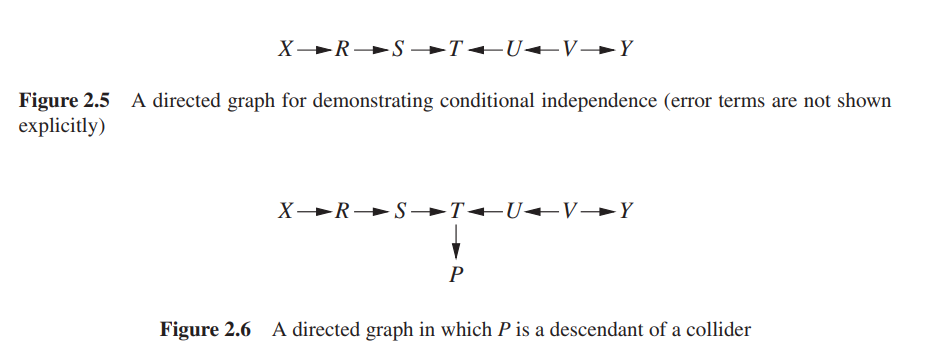
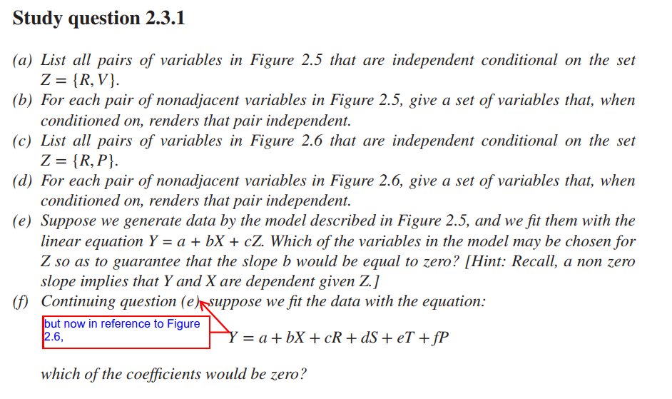
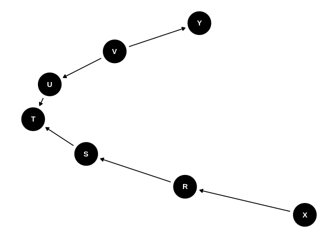
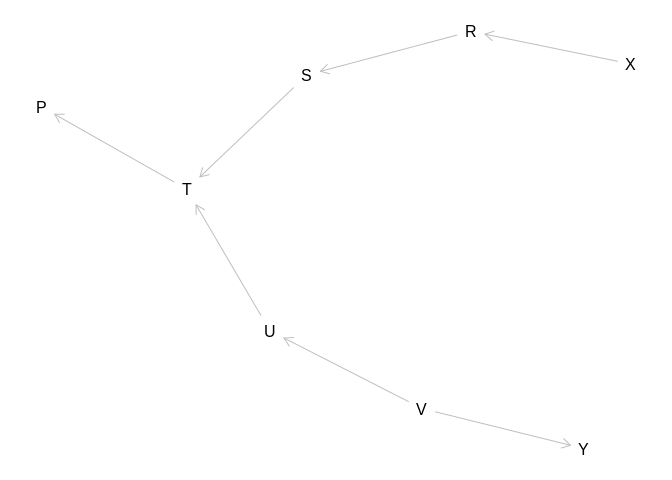
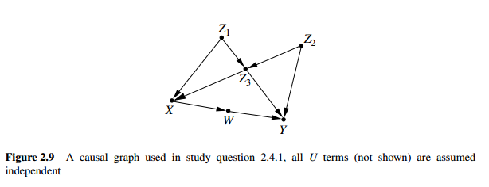
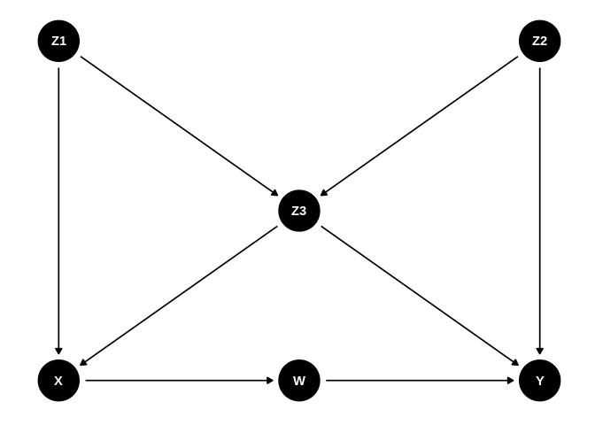
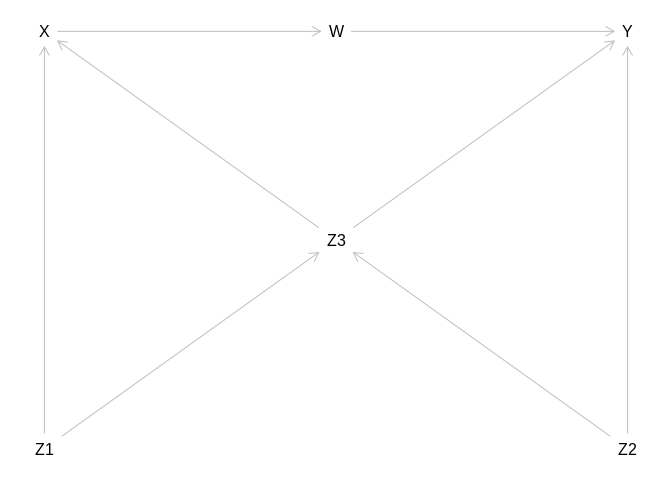

Study questions chapter 2
================
João Pedro S. Macalós
2/25/2020

# Study questions (chapter 2)

Packages:

``` r
library(tidyverse)
```

    ## ── Attaching packages ──────────────────────────────────────────────────────────────────────────────────────────── tidyverse 1.3.0 ──

    ## ✓ ggplot2 3.2.1     ✓ purrr   0.3.3
    ## ✓ tibble  2.1.3     ✓ dplyr   0.8.3
    ## ✓ tidyr   1.0.0     ✓ stringr 1.4.0
    ## ✓ readr   1.3.1     ✓ forcats 0.4.0

    ## ── Conflicts ─────────────────────────────────────────────────────────────────────────────────────────────── tidyverse_conflicts() ──
    ## x dplyr::filter() masks stats::filter()
    ## x dplyr::lag()    masks stats::lag()

``` r
library(knitr)
library(dagitty)
library(ggdag)
```

    ## 
    ## Attaching package: 'ggdag'

    ## The following object is masked from 'package:stats':
    ## 
    ##     filter

Set dag theme:

``` r
theme_set(theme_dag())
```

## 2.3.1

``` r

```

<!-- -->

``` r

```

<!-- -->

#### a)

``` r
tba <-
  tribble(~pair, ~reason,
          'X, S', 'blocked by R',
          'X, T', 'blocked by R',
          'X, U', 'blocked by T already, R, V doesnt change',
          'X, Y', 'blocked by T already, R, V doesnt change',
          'S, U', 'blocked by T already, V doesnt change',
          'S, Y', 'blocked by V',
          'U, Y', 'blocked by V',
          'T, Y', 'blocked by V')

tba
```

    ## # A tibble: 8 x 2
    ##   pair  reason                                  
    ##   <chr> <chr>                                   
    ## 1 X, S  blocked by R                            
    ## 2 X, T  blocked by R                            
    ## 3 X, U  blocked by T already, R, V doesnt change
    ## 4 X, Y  blocked by T already, R, V doesnt change
    ## 5 S, U  blocked by T already, V doesnt change   
    ## 6 S, Y  blocked by V                            
    ## 7 U, Y  blocked by V                            
    ## 8 T, Y  blocked by V

#### b)

``` r
tbb <-
  tribble(~pair, ~set,
          'X, S', '{R}',
          'X, T', '{R, S}',
          'X, U', '{}',
          'X, V', '{}',
          'X, Y', '{}',
          'R, T', '{S}',
          'R, U', '{}',
          'R, V', '{}',
          'R, Y', '{}',
          'S, U', '{}',
          'S, V', '{}',
          'S, Y', '{}',
          'T, V', '{U}',
          'T, Y', '{U, V}',
          'U, Y', '{V}')

tbb
```

    ## # A tibble: 15 x 2
    ##    pair  set   
    ##    <chr> <chr> 
    ##  1 X, S  {R}   
    ##  2 X, T  {R, S}
    ##  3 X, U  {}    
    ##  4 X, V  {}    
    ##  5 X, Y  {}    
    ##  6 R, T  {S}   
    ##  7 R, U  {}    
    ##  8 R, V  {}    
    ##  9 R, Y  {}    
    ## 10 S, U  {}    
    ## 11 S, V  {}    
    ## 12 S, Y  {}    
    ## 13 T, V  {U}   
    ## 14 T, Y  {U, V}
    ## 15 U, Y  {V}

#### c)

Conditioning on P opens the collider path. Therefore, only the
relationship between X and the rest are blocked by R.

``` r
tbc <- tibble(pair = c('X, S', 'X, T', 'X, U', 'X, V', 'X, Y'))
tbc
```

    ## # A tibble: 5 x 1
    ##   pair 
    ##   <chr>
    ## 1 X, S 
    ## 2 X, T 
    ## 3 X, U 
    ## 4 X, V 
    ## 5 X, Y

#### d)

``` r
tbd <-
  tribble(~pair, ~set,
          'X, S', '{R}',
          'X, T', '{R, S}',
          'X, P', '{R, S, T}',
          'X, U', '{}',
          'X, V', '{}',
          'X, Y', '{}',
          'R, T', '{S}',
          'R, P', '{S, T}',
          'R, U', '{}',
          'R, V', '{}',
          'R, Y', '{}',
          'S, P', '{T}',
          'S, U', '{}',
          'S, V', '{}',
          'S, Y', '{}',
          'T, V', '{U}',
          'T, Y', '{U, V}',
          'P, U', '{T}',
          'P, V', '{T, V}',
          'P, Y', '{T, U, V}',
          'U, Y', '{V}')

tbd
```

    ## # A tibble: 21 x 2
    ##    pair  set      
    ##    <chr> <chr>    
    ##  1 X, S  {R}      
    ##  2 X, T  {R, S}   
    ##  3 X, P  {R, S, T}
    ##  4 X, U  {}       
    ##  5 X, V  {}       
    ##  6 X, Y  {}       
    ##  7 R, T  {S}      
    ##  8 R, P  {S, T}   
    ##  9 R, U  {}       
    ## 10 R, V  {}       
    ## # … with 11 more rows

#### e)

Given the collider T in the middle of the graph, we know that the
variables X and Y are already independent from each other. Therefore, we
need to chose which variables that wouldn’t affect the structure of the
graph to condition on. In other words, we must choose those variables
that won’t open the path closed by the collider. These variables are:

  
  

#### f)

Adding terms to linear equation means that we are conditioning on the
relationship of every variable included in the other terms. That’s the
meaning of the *ceteris paribus*: keeping all the rest of the variables
constant, what’s the relationship between X and Y?

Thus, in Figure 6, we want to know which partial coefficients will be
equal to zero. They are going to be .

## 2.3.1 using `dagitty`

These questions can be answered using the `dagitty` package. The answer
is available at the
[dagitty.net](http://dagitty.net/primer/#graphical-models-and-their-applications)
website.

I’ll reproduce them here to get used to the code:

Define the two graphs:

``` r
dag1 <- dagitty("dag {
                X -> R -> S -> T <- U <- V -> Y
                }")

ggdag(dag1)
```

<!-- -->

``` r
dag2 <- dagitty("dag {
                X -> R -> S -> T <- U <- V -> Y
                T -> P
                }")

plot(graphLayout(dag2))
```

<!-- -->

#### a)

To determine wether two variables are independent given a set of
variables:

``` r
paths(dag1, 'X', 'Y', c('R', 'V'))
```

    ## $paths
    ## [1] "X -> R -> S -> T <- U <- V -> Y"
    ## 
    ## $open
    ## [1] FALSE

To answer the question programmatically:

``` r
pairs <- combn(c("X", 'S', 'T', 'U', 'Y'), 2)

apply(pairs, 2, function(X) {
  p <- paths(dag1, X[1], X[2], c("R", "V"))
  if (!p$open) {
    message(X[1], " and ", X[2], " are independent given {R, V}")
  } else {
    message(X[1], " and ", X[2], " are possibly dependent giver {R, V}")
  }
})
```

    ## X and S are independent given {R, V}

    ## X and T are independent given {R, V}

    ## X and U are independent given {R, V}

    ## X and Y are independent given {R, V}

    ## S and T are possibly dependent giver {R, V}

    ## S and U are independent given {R, V}

    ## S and Y are independent given {R, V}

    ## T and U are possibly dependent giver {R, V}

    ## T and Y are independent given {R, V}

    ## U and Y are independent given {R, V}

    ## NULL

#### b)

``` r
impliedConditionalIndependencies(dag1)
```

    ## R _||_ T | S
    ## R _||_ U
    ## R _||_ V
    ## R _||_ Y
    ## S _||_ U
    ## S _||_ V
    ## S _||_ X | R
    ## S _||_ Y
    ## T _||_ V | U
    ## T _||_ X | R
    ## T _||_ X | S
    ## T _||_ Y | V
    ## T _||_ Y | U
    ## U _||_ X
    ## U _||_ Y | V
    ## V _||_ X
    ## X _||_ Y

#### c)

``` r
pairs <- combn(c("X", 'S', 'T', 'U', 'Y', "V"), 2)

apply(pairs, 2, function(X) {
  if (dseparated(dag2, X[1], X[2], c("R", "P"))) {
    message(X[1], " and ", X[2], " are independent given {R, P}")
  } else {
    message(X[1], " and ", X[2], " are possibly dependent given {R, P}")
  }
})
```

    ## X and S are independent given {R, P}

    ## X and T are independent given {R, P}

    ## X and U are independent given {R, P}

    ## X and Y are independent given {R, P}

    ## X and V are independent given {R, P}

    ## S and T are possibly dependent given {R, P}

    ## S and U are possibly dependent given {R, P}

    ## S and Y are possibly dependent given {R, P}

    ## S and V are possibly dependent given {R, P}

    ## T and U are possibly dependent given {R, P}

    ## T and Y are possibly dependent given {R, P}

    ## T and V are possibly dependent given {R, P}

    ## U and Y are possibly dependent given {R, P}

    ## U and V are possibly dependent given {R, P}

    ## Y and V are possibly dependent given {R, P}

    ## NULL

#### d)

``` r
impliedConditionalIndependencies(dag2)
```

    ## P _||_ R | S
    ## P _||_ R | T
    ## P _||_ S | T
    ## P _||_ U | T
    ## P _||_ V | U
    ## P _||_ V | T
    ## P _||_ X | R
    ## P _||_ X | S
    ## P _||_ X | T
    ## P _||_ Y | V
    ## P _||_ Y | U
    ## P _||_ Y | T
    ## R _||_ T | S
    ## R _||_ U
    ## R _||_ V
    ## R _||_ Y
    ## S _||_ U
    ## S _||_ V
    ## S _||_ X | R
    ## S _||_ Y
    ## T _||_ V | U
    ## T _||_ X | R
    ## T _||_ X | S
    ## T _||_ Y | V
    ## T _||_ Y | U
    ## U _||_ X
    ## U _||_ Y | V
    ## V _||_ X
    ## X _||_ Y

#### e)

``` r
map_lgl(names(dag1), ~dseparated(dag1,"X","Y",.x)) %>% set_names(names(dag1))
```

    ##     R     S     T     U     V     X     Y 
    ##  TRUE  TRUE FALSE  TRUE  TRUE  TRUE  TRUE

This result shows that X and Y are d-separated, i.e., independent given
all variables except for T (the collider).

This result can be validated by generating data from the graph:

``` r
d <- simulateSEM(dag1, .7, .7, N = 1000)
```

\[Sentence copied from the website below\] The `simulateSEM` function
chooses path coefficients for the model uniformly from the interval
given by the second and third parameters. The given values sets this
interval ta the single value 0.7, which ensures that the correlations in
the generated data are strong enough to be picked up. Now, we validate
our solution:

``` r
confint(lm(Y ~ X + T, data = d))
```

    ##                   2.5 %      97.5 %
    ## (Intercept) -0.04657898  0.06942361
    ## X           -0.15652857 -0.03137309
    ## T            0.29732043  0.41705289

Indeed, conditioning on T makes the variables associated with each
other.

#### f)

We can answer this question by invoking the function dseparated in a
different way, namely by supplying the empty set as argument Y. This
way, instead of checking whether given variables X,Y are d-separated by
Z, it returns the set of variables that are d-separated from X by Z.

``` r
predictors <- c('X', 'R', 'S', 'T', 'P')
intersect(predictors, dseparated(dag2, 'Y', list(), predictors))
```

    ## [1] "X" "R" "P"

## 2.4.1

``` r

```

<!-- -->

#### a)

> For each pair of nonadjacent nodes in this graph, find a set of
> variables that d-separates that pair. What does this list tell us
> about independencies in the data?

By hand:

``` r
tba <- 
  tribble(
    ~pair, ~set_that_dseparate,
    'X, Z2', '{Z1, Z3}',
    'X, Y', '{W, Z3, Z2} or {W, Z3, Z1}',
    'Z1, W', '{X}',
    'Z1, Z2', '{}',
    'Z1, Y', '{Z3, Z2, X} or {Z3, Z2, W}',
    'Z3, W', '{X}',
    'W, Z2', '{X} or {Z3, Z1}',
  )
```

Using `dagitty`:

``` r
dag1 <- dagify(X ~ Z1,
               X ~ Z3,
               W ~ X,
               Z3 ~ Z1,
               Z3 ~ Z2,
               Y ~ Z2,
               Y ~ Z3,
               Y ~ W)

coords <- tribble(
  ~name, ~x, ~y,
  'X', 0, 0,
  'W', 5, 0,
  'Y', 10, 0,
  'Z3', 5, 5,
  'Z1', 0, 10,
  'Z2', 10, 10
)

coordinates(dag1) <- coords2list(coords)

ggdag(dag1)
```



``` r
impliedConditionalIndependencies(dag1)
```

    ## W _||_ Z1 | X
    ## W _||_ Z2 | Z1, Z3
    ## W _||_ Z2 | X
    ## W _||_ Z3 | X
    ## X _||_ Y | W, Z2, Z3
    ## X _||_ Y | W, Z1, Z3
    ## X _||_ Z2 | Z1, Z3
    ## Y _||_ Z1 | X, Z2, Z3
    ## Y _||_ Z1 | W, Z2, Z3
    ## Z1 _||_ Z2

#### b)

> Repeat question (a) assuming that only variables in the set {Z3, W, X,
> Z1} can be measured.

``` r
latents(dag1) <- c('Z2', 'Y')

impliedConditionalIndependencies(dag1)
```

    ## W _||_ Z1 | X
    ## W _||_ Z3 | X

``` r
latents(dag1) <- c()
```

#### c)

> For each pair of nonadjacent nodes in the graph, determine whether
> they are independent conditional on all other variables.

``` r
pairs <- combn(c("X", 'Y', 'W', 'Z1', 'Z2', "Z3"), 2)

apply(pairs, 2, function(X) {
  set <- setdiff(names(dag1), X)
  if (dseparated(dag1, X[1], X[2], set)) {
    message(X[1], " and ", X[2], " are independent given {", str_c(set, collapse = ' ,'), "}")
  } else {
    message(X[1], " and ", X[2], " are possibly dependent given {", str_c(set, collapse = ' ,'), "}")
  }
})
```

    ## X and Y are independent given {W ,Z1 ,Z2 ,Z3}

    ## X and W are possibly dependent given {Y ,Z1 ,Z2 ,Z3}

    ## X and Z1 are possibly dependent given {W ,Y ,Z2 ,Z3}

    ## X and Z2 are independent given {W ,Y ,Z1 ,Z3}

    ## X and Z3 are possibly dependent given {W ,Y ,Z1 ,Z2}

    ## Y and W are possibly dependent given {X ,Z1 ,Z2 ,Z3}

    ## Y and Z1 are independent given {W ,X ,Z2 ,Z3}

    ## Y and Z2 are possibly dependent given {W ,X ,Z1 ,Z3}

    ## Y and Z3 are possibly dependent given {W ,X ,Z1 ,Z2}

    ## W and Z1 are independent given {X ,Y ,Z2 ,Z3}

    ## W and Z2 are possibly dependent given {X ,Y ,Z1 ,Z3}

    ## W and Z3 are possibly dependent given {X ,Y ,Z1 ,Z2}

    ## Z1 and Z2 are possibly dependent given {W ,X ,Y ,Z3}

    ## Z1 and Z3 are possibly dependent given {W ,X ,Y ,Z2}

    ## Z2 and Z3 are possibly dependent given {W ,X ,Y ,Z1}

    ## NULL

#### d)

> For every variable V in the graph, find a minimal set of nodes that
> renders V independent of all other variables in the graph.

The solution of this exercise is present in the `dagitty` package
website. According to its words:

> The set of all parents, all children, and all children’s parents of a
> variable is guaranteed to separate V from all other variables. It is
> also guaranteed to be minimal: Parents and children must be included,
> and including the children \> means that their parents must also be
> included. In the literature, that set is known as a variable’s Markov
> blanket.

This concept is not mentioned in the primer.

``` r
for(v in names(dag1)){
    cat("Variable", v, ":", markovBlanket(dag1, v), "\n")
}
```

    ## Variable W : X Y Z2 Z3 
    ## Variable X : Z1 Z3 W 
    ## Variable Y : W Z2 Z3 
    ## Variable Z1 : X Z3 Z2 
    ## Variable Z2 : Y Z3 W Z1 
    ## Variable Z3 : Z1 Z2 X Y W

#### e)

> Suppose we wish to estimate the value of Y from measurements taken on
> all other variables in the model. Find the smallest set of variables
> that would yield as good an estimate of Y as when we measured all
> variables

In this question, we want to find a set of variables that have the same
dependencies as the one found in:

  
  
By inspecting the DAG and doing by hand we can see that if we control
for W, Z2 and Z3 we will get the same dependencies.

Programatically, you can also solve this question using the `dconnected`
function from `dagitty`. To understand the code, it is important to
remember that by providing the empty set as an argument for Y we check
which variables are connected to “Y” by the set Z (predictors). The
`intersect` function is called because the `dconnected` function also
returns the original variable “Y”.

``` r
predictors <- setdiff(names(dag1), "Y")
connected <- dconnected(dag1, "Y", list(), predictors)
intersect(predictors, connected)
```

    ## [1] "W"  "Z2" "Z3"

#### f)

> Repeat question (e) assuming that we wish to estimate the value of Z2

By hand we can see that the answer must be controlling for Z3, Z1, Y and
W.

``` r
predictors <- setdiff(names(dag1), "Z2")
connected <- dconnected(dag1, "Z2", list(), predictors)
intersect(predictors, connected)
```

    ## [1] "W"  "Y"  "Z1" "Z3"

#### g)

> Suppose we wish to predict the value of Z2 from measurements of Z3.
> Would the quality of our prediction improve if we add measurement of
> W? Explain.

That’s an interesting question. As mentioned in the `dagitty` website,
mathematically speaking, a prediction can never get worst if you add an
extra variable. So at least in this sense the answer must be Yes, even
if by a very tiny amount.

However, to give a better answer to this question, we have to check if
there is an open path between Z2 and W when Z3 is being controlled.

``` r
dconnected(dag1, 'Z2', 'W', 'Z3')
```

    ## [1] TRUE

So yes, they are connected. The open path is:

``` r
p <- paths(dag1, 'Z2', 'W', 'Z3')
p$paths[p$open]
```

    ## [1] "Z2 -> Z3 <- Z1 -> X -> W"

## 2.5.1

Fig 2.9

``` r
ggdag(dag1)
```

<!-- -->

#### a)

> Which of the arrows in Figure 2.9 can be reversed without being
> detected by any statistical test? \[Hint: Use the criterion for
> equivalence class.

All edges are connected to a collider or would become a collider if they
were inverted. Therefore, this model is unique. We can verify this using
the `dagitty` package:

``` r
length(equivalentDAGs(dag1))
```

    ## [1] 1

``` r
plot(equivalenceClass(dag1))
```

<!-- -->

#### b)

> List all graphs that are observationally equivalent to the one in
> Figure 2.9.

Since the graph in 2.9. is unique, there is no equivalent one.

#### c)

> List the arrows in Figure 2.9 whose directionality can be determined
> from nonexperimental data.

All arrows modifying any of them would affect the results.

#### d)

> Write down a regression equation for Y such that, if a certain
> coefficient in that equation is nonzero, the model of Figure 2.9 is
> wrong.

My first answer:

  
  

To answer this question, we must compare the above model – that controls
for all variables – with the smallest set that would find the same
dependencies, as was done in question 2.4.1.e.

``` r
predictors <- setdiff(names(dag1), "Y")

separated <- dseparated(dag1, "Y", list(), predictors)
s1 <- intersect(predictors, separated)
s2 <- tibble(vars = s1, description = rep('Separated', length(s1)))

connected <- dconnected(dag1, 'Y', list(), predictors)
c1 <- intersect(predictors, connected)
c2 <- tibble(vars = c1, description = rep('Connected', length(c1)))

bind_rows(s2, c2)
```

    ## # A tibble: 5 x 2
    ##   vars  description
    ##   <chr> <chr>      
    ## 1 X     Separated  
    ## 2 Z1    Separated  
    ## 3 W     Connected  
    ## 4 Z2    Connected  
    ## 5 Z3    Connected

Since X and Z1 are separated from Y, we can infer that if the
coefficients associated with these variables (a and c) are nonzero, the
model is wrong. **This answer provides a valid answer, but it is not how
one should solve it.**

One should look to the implied conditional independencies:

``` r
latents(dag1) <- c()
impliedConditionalIndependencies(dag1)
```

    ## W _||_ Z1 | X
    ## W _||_ Z2 | Z1, Z3
    ## W _||_ Z2 | X
    ## W _||_ Z3 | X
    ## X _||_ Y | W, Z2, Z3
    ## X _||_ Y | W, Z1, Z3
    ## X _||_ Z2 | Z1, Z3
    ## Y _||_ Z1 | X, Z2, Z3
    ## Y _||_ Z1 | W, Z2, Z3
    ## Z1 _||_ Z2

We can take the first conditional independency that involves Y, i.e., X
and Y are independent if {W, Z2 and Z3} are included in the model.

We can then test if this is true:

``` r
d <- simulateSEM(dag1, .4, .4)
coef(summary(lm(Y ~ X + W + Z2 + Z3, d))) %>% round(digits = 3)
```

    ##             Estimate Std. Error t value Pr(>|t|)
    ## (Intercept)   -0.059      0.023  -2.558    0.011
    ## X             -0.019      0.029  -0.677    0.498
    ## W              0.409      0.025  16.235    0.000
    ## Z2             0.370      0.024  15.169    0.000
    ## Z3             0.362      0.028  12.715    0.000

As we can see, controlled for these variables, X is equal to zero.

If W were not controlled:

``` r
coef(summary(lm(Y ~ X + Z2 + Z3, d))) %>% round(digits = 3)
```

    ##             Estimate Std. Error t value Pr(>|t|)
    ## (Intercept)   -0.040      0.029  -1.401    0.162
    ## X              0.099      0.034   2.910    0.004
    ## Z2             0.364      0.030  12.063    0.000
    ## Z3             0.371      0.035  10.520    0.000

#### e)

> Repeat question (d) for variable Z3.

Z3 is an interesting variable because the only variable it is not
adjacent to is W. We can check the implied conditional dependencies of
dag1:

``` r
impliedConditionalIndependencies_tibble <- function(ici) {
  suppressWarnings(
    map_df(ici, ~str_c(.x)) %>% gather(key, value) %>%
    mutate(expr = value) %>%
    separate(value, c('var', 'i'), sep = '_\\|\\|_') %>%
    separate(i, c('independent_of', 'conditional_on'), sep = '\\|') %>%
    select(-key) %>%
    select(expr, everything())
  )
}
```

``` r
a <- impliedConditionalIndependencies(dag1)
impliedConditionalIndependencies_tibble(a) %>%
  filter(str_detect(independent_of, 'Z3'))
```

    ## # A tibble: 1 x 4
    ##   expr          var   independent_of conditional_on
    ##   <chr>         <chr> <chr>          <chr>         
    ## 1 W _||_ Z3 | X "W "  " Z3 "         " X"

``` r
  #filter(str_detect(var, 'Z3'))
```

We can see that the only conditional independency that involves Z3 is
with W, conditioned on X. Therefore, we can test the following model:

  
  
Given the structure of the model, we know that W should be independent
of Z3 conditioned on X.

We can check that this is indeed the case with simulation:

``` r
d <- simulateSEM(dag1, .4, .4)
coef(summary(lm(Z3 ~ X + W, d))) %>% round(digits = 3)
```

    ##             Estimate Std. Error t value Pr(>|t|)
    ## (Intercept)    0.027      0.038   0.713    0.476
    ## X              0.515      0.043  12.085    0.000
    ## W              0.053      0.040   1.335    0.182

#### f)

> Repeat question (e) assuming the X is not measured.

``` r
latents(dag1) <- 'X'
impliedConditionalIndependencies(dag1)
```

    ## W _||_ Z2 | Z1, Z3
    ## Y _||_ Z1 | W, Z2, Z3
    ## Z1 _||_ Z2

We see how the conditional independencies shrinked by transforming X
into a latent variable. Furthermore, we can see that by omitting X we
cannot make the same test as was done in the previous exercise.

#### g)

> How many regression equations of the type described in (d) and (e) are
> needed to ensure that the model is fully tested, namely, that if it
> passes all these tests it cannot be refuted by additional tests of
> these kind. \[Hint: Ensure that you test every vanishing partial
> regression coefficient that is implied by the product decomposition
> (1.29).\]

The hint suggests that we should use the product decomposition of (1.29)
to solve this exercise.

  
 = P(Y|Z2, Z3, W) \\cdot P(W|X) \\cdot P(X|Z1, Z2) \\cdot P(Z1) \\cdot P(Z2) \\cdot P(Z3|Z1, Z2)
")  
My first, intuitive answer was 4, since
") and
") doesn’t
imply any equation to test. But I can’t figure out the connection
between this hint and the answer.

According to Kline (2015, p. 173):

> The basis set for a DAG includes the smallest number of conditional
> independences that imply all others (if any) located by the
> d-separation criterion. The size of the basis set equals the number of
> pairs of nonadjacent variables that can be d-separated. Any
> conditional independences beyond this number are implied by the basis
> set; that is, they are redundant, so there is no need to test them
> all.

Therefore, we need to find the basis set. Although the basis set does
not have to be unique, Kline (2015, p. 174) describes a straightforward
method to find it, based on Pearh and Meshkat (1999) and on Shipley
(2000):

> List each unique pair of nonadjacent variables in the graph that can
> be d-separated. Next, condition on the parents of both variables in
> each pair. The corresponding set of conditional independences is a
> basis set.

Let’s calculate the basis set. First, it is useful to reprint the
DAG:

``` r
ggdag(dag1)
```


``` r
tribble(~non_adjacent_pairs, ~parents_of_both_variables, ~conditional_independence,
        'X, Z2', 'Z1, Z3', 'X _||_ Z2 | Z1, Z3',
        'X, Y', 'Z1, W, Z3, Z2', 'X _||_ Y | Z1, W, Z3, Z2',
        'Z1, W', 'X', 'Z1 _||_ W | X',
        'Z1, Y', 'Z3, W, Z2', 'Z1 _||_ Y | Z3, W, Z2',
        'Z1, Z2', '', 'Z1 _||_ Z2',
        'Z3, W', 'X, Z1, Z2', 'Z3 _||_ W | X, Z1, Z2',
        'W, Z2', 'X', 'W _||_ Z2 | X')
```

    ## # A tibble: 7 x 3
    ##   non_adjacent_pairs parents_of_both_variables conditional_independence
    ##   <chr>              <chr>                     <chr>                   
    ## 1 X, Z2              "Z1, Z3"                  X _||_ Z2 | Z1, Z3      
    ## 2 X, Y               "Z1, W, Z3, Z2"           X _||_ Y | Z1, W, Z3, Z2
    ## 3 Z1, W              "X"                       Z1 _||_ W | X           
    ## 4 Z1, Y              "Z3, W, Z2"               Z1 _||_ Y | Z3, W, Z2   
    ## 5 Z1, Z2             ""                        Z1 _||_ Z2              
    ## 6 Z3, W              "X, Z1, Z2"               Z3 _||_ W | X, Z1, Z2   
    ## 7 W, Z2              "X"                       W _||_ Z2 | X

That would imply 7 equations in the basis set.

However, in the `dagitty` website companion to the book, the authors
take advantage of the concept of **basis set** which is not explained in
the book, and I cannot clearly relate to the product decomposition
anyways. I quote their answer to the problem:

> A set of regression equations like this is called a basis set. We can
> use the following command to generate, for each variable, the
> statement that this variable is independent of its non-descendants
> given its parents. This set constitutes a basis set.

They then provide the code to solve the problem:

``` r
latents(dag1) <- c() # undo out setting of X as latent from (f)
impliedConditionalIndependencies(dag1, type="basis.set")
```

    ## W _||_ Z1, Z2, Z3 | X
    ## X _||_ Z2 | Z1, Z3
    ## Y _||_ X, Z1 | W, Z2, Z3
    ## Z1 _||_ Z2
    ## Z2 _||_ Z1

According to the website,

> The last two items of the basis set are clearly identical, so we end
> up with four independence statement. Each of those again corresponds
> to a regression equation. For instance, the first statement implies
> that the coefficients of the Z’s in the following regression must be
> 0:

``` r
d <- simulateSEM(dag1, .4, .4)
coef(summary(lm(W ~ X + Z1 + Z2 + Z3, d))) %>% round(digits = 3)
```

    ##             Estimate Std. Error t value Pr(>|t|)
    ## (Intercept)   -0.050      0.042  -1.198    0.232
    ## X              0.457      0.058   7.943    0.000
    ## Z1            -0.017      0.052  -0.336    0.737
    ## Z2             0.035      0.046   0.760    0.448
    ## Z3             0.026      0.057   0.450    0.653

Since the basis set does not have to be unique, there is probably more
than one answer to this question. Unfortunatelly there is no
documentation on the `dagitty` package to see how the basis set is
calculated.
