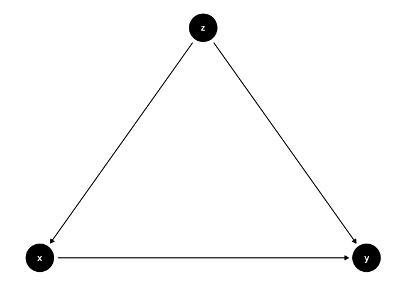

Study questions (chapter 3)
================
João Pedro S. Macalós
3/4/2020

Packages:

``` r
library(tidyverse)
```

    ## ── Attaching packages ──────────────────────────────────────────────────────────────────────────────────────────── tidyverse 1.3.0 ──

    ## ✓ ggplot2 3.2.1     ✓ purrr   0.3.3
    ## ✓ tibble  2.1.3     ✓ dplyr   0.8.3
    ## ✓ tidyr   1.0.0     ✓ stringr 1.4.0
    ## ✓ readr   1.3.1     ✓ forcats 0.4.0

    ## ── Conflicts ─────────────────────────────────────────────────────────────────────────────────────────────── tidyverse_conflicts() ──
    ## x dplyr::filter() masks stats::filter()
    ## x dplyr::lag()    masks stats::lag()

``` r
library(knitr)
library(dagitty)
library(ggdag)
```

    ## 
    ## Attaching package: 'ggdag'

    ## The following object is masked from 'package:stats':
    ## 
    ##     filter

``` r
library(kableExtra)
```

    ## 
    ## Attaching package: 'kableExtra'

    ## The following object is masked from 'package:dplyr':
    ## 
    ##     group_rows

Set dag theme:

``` r
theme_set(theme_dag())
```

## 3.2.1

> Referring to study question 1.5.2 (Figure 1.10) and the parameters
> listed therein

Figure 1.10:

``` r
fig10 <- dagify(x ~ z,
       y ~ x, y ~ z,
       coords = tribble(
         ~name, ~x, ~y,
         'x', 0, 0,
         'y', 6, 0,
         'z', 3, 3
       ))

ggdag(fig10)
```

<!-- -->

Table of probs:

``` r
tribble(
    ~prob, ~expression,
    'r', 'P(Z=1)',
    '1-r', 'P(Z=0)',
    'q_0', 'P(X_1|Z_0)',
    'q_1', 'P(X_1|Z_1)',
    '1-q_0', 'P(X_0|Z_0)',
    '1-q_1', 'P(X_0|Z_1)',
    'p1', 'P(Y_1|X_0,Z_0)',
    'p2', 'P(Y_1|X_1,Z_0)',
    'p3', 'P(Y_1|X_0,Z_1)',
    'p4', 'P(Y_1|X_1,Z_1)',
    '1-p1', 'P(Y_0|X_0,Z_0)',
    '1-p2', 'P(Y_0|X_1,Z_0)',
    '1-p3', 'P(Y_0|X_0,Z_1)',
    '1-p4', 'P(Y_0|X_1,Z_1)'
  ) #%>%
```

    ## # A tibble: 14 x 2
    ##    prob  expression    
    ##    <chr> <chr>         
    ##  1 r     P(Z=1)        
    ##  2 1-r   P(Z=0)        
    ##  3 q_0   P(X_1|Z_0)    
    ##  4 q_1   P(X_1|Z_1)    
    ##  5 1-q_0 P(X_0|Z_0)    
    ##  6 1-q_1 P(X_0|Z_1)    
    ##  7 p1    P(Y_1|X_0,Z_0)
    ##  8 p2    P(Y_1|X_1,Z_0)
    ##  9 p3    P(Y_1|X_0,Z_1)
    ## 10 p4    P(Y_1|X_1,Z_1)
    ## 11 1-p1  P(Y_0|X_0,Z_0)
    ## 12 1-p2  P(Y_0|X_1,Z_0)
    ## 13 1-p3  P(Y_0|X_0,Z_1)
    ## 14 1-p4  P(Y_0|X_1,Z_1)

``` r
  #mutate_at(vars(prob, expression), list(~ str_c('$', ., '$'))) %>%
  #kable(escape = F)
```

#### a)

> Compute P(y|do(x)) for all values of x and y, by simulating the
> intervention do(x) on the model

From exercise 1.5.2:

``` r
set.seed(777)

simpsons <- tibble(id = 1:1000) %>%
  mutate(syn = sample(c(F, T), size = 1000, replace = T, prob = c(.8, .2))) %>%
  mutate(drug = case_when(syn == F ~ sample(c(F, T), size = length(.$syn == F), replace = T, prob = c(.8, .2)),
                          syn == T ~ sample(c(F, T), size = length(.$syn == T), replace = T, prob = c(.3, .7)))) %>%
  mutate(die = case_when(syn == F & drug == T ~ sample(c(F, T), size = length(.$syn == F & .$drug == T), replace = T, prob = c(.9, .1)),
                         syn == F & drug == F ~ sample(c(F, T), size = length(.$syn == F & .$drug == F), replace = T, prob = c(.9, .1)),
                         syn == T & drug == T ~ sample(c(F, T), size = length(.$syn == T & .$drug == T), replace = T, prob = c(.6, .4)),
                         syn == T & drug == F ~ sample(c(F, T), size = length(.$syn == T & .$drug == F), replace = T, prob = c(.2, .8))))
```

``` r
simpsons %>%
  summarize_all(mean)
```

    ## # A tibble: 1 x 4
    ##      id   syn  drug   die
    ##   <dbl> <dbl> <dbl> <dbl>
    ## 1  500. 0.181 0.282 0.176

``` r
r <- 0.196 # Z1 / Syndrome
```

``` r
simpsons %>%
  filter(syn == 0) %>%
  summarize_all(mean)
```

    ## # A tibble: 1 x 4
    ##      id   syn  drug   die
    ##   <dbl> <dbl> <dbl> <dbl>
    ## 1  503.     0 0.189 0.103

``` r
simpsons %>%
  filter(syn == 1) %>%
  summarize_all(mean)
```

    ## # A tibble: 1 x 4
    ##      id   syn  drug   die
    ##   <dbl> <dbl> <dbl> <dbl>
    ## 1  489.     1 0.702 0.508

``` r
q0 <- 0.189 # P(X1 | Z0)
q1 <- 0.701 # P(X1 | Z1)
```

``` r
simpsons %>% filter(drug == 0, syn == 0) %>% summarize_all(mean)
```

    ## # A tibble: 1 x 4
    ##      id   syn  drug   die
    ##   <dbl> <dbl> <dbl> <dbl>
    ## 1  512.     0     0 0.108

``` r
simpsons %>% filter(drug == 1, syn == 0) %>% summarize_all(mean)
```

    ## # A tibble: 1 x 4
    ##      id   syn  drug    die
    ##   <dbl> <dbl> <dbl>  <dbl>
    ## 1  463.     0     1 0.0774

``` r
simpsons %>% filter(drug == 0, syn == 1) %>% summarize_all(mean)
```

    ## # A tibble: 1 x 4
    ##      id   syn  drug   die
    ##   <dbl> <dbl> <dbl> <dbl>
    ## 1  464.     1     0 0.815

``` r
simpsons %>% filter(drug == 1, syn == 1) %>% summarize_all(mean)
```

    ## # A tibble: 1 x 4
    ##      id   syn  drug   die
    ##   <dbl> <dbl> <dbl> <dbl>
    ## 1  499.     1     1 0.378

``` r
p1 <- 0.108 # P(Y1 | X0, Z0)
p2 <- 0.077 # P(Y1 | X1, Z0)
p3 <- 0.814 # P(Y1 | X0, Z1)
p4 <- 0.377 # P(Y1 | X1, Z1)
```

``` r
N <- 10000  # number of individuals

set.seed(777)

part_a <- tibble(z = rbinom(N, 1, r)) %>% 
  mutate(
    x = rbinom(n(), 1, 0.5), # no Z-dependence
    p_y_given_x_z = case_when(
      x == 0 & z == 0 ~ p1,
      x == 1 & z == 0 ~ p2,
      x == 0 & z == 1 ~ p3,
      x == 1 & z == 1 ~ p4
    ),
    y = rbinom(n(), 1, p_y_given_x_z)
  ) %>% 
  group_by(x, y) %>% 
  summarise(n = n()) %>% 
  mutate(p_y_given_do_x = n / sum(n))
```

Answer by simulation:

``` r
part_a
```

    ## # A tibble: 4 x 4
    ## # Groups:   x [2]
    ##       x     y     n p_y_given_do_x
    ##   <int> <int> <int>          <dbl>
    ## 1     0     0  3752          0.745
    ## 2     0     1  1286          0.255
    ## 3     1     0  4290          0.865
    ## 4     1     1   672          0.135

#### b)

> Compute P(y|do(x)) for all values of x and y, using the adjustment
> formula (3.5)

``` r
part_b <- tribble(
  ~y, ~x, ~prob,
  '0', '0', (1 - p1) * (1 - r) + (1 - p3) * r,
  '0', '1', (1 - p2) * (1 - r) + (1 - p4) * r,
  '1', '0', p1 * (1-r) + p3 * r,
  '1', '1', p2 * (1-r) + p4 * r
) %>%
  mutate(expression = str_c('p_', y, '_given_do_', x)) %>%
  select(y, x, expression, prob) %>%
  arrange(x)

part_b
```

    ## # A tibble: 4 x 4
    ##   y     x     expression      prob
    ##   <chr> <chr> <chr>          <dbl>
    ## 1 0     0     p_0_given_do_0 0.754
    ## 2 1     0     p_1_given_do_0 0.246
    ## 3 0     1     p_0_given_do_1 0.864
    ## 4 1     1     p_1_given_do_1 0.136

#### c)

> Compute the ACE

  
) - P(y_1 | do(x_0))
")  

``` r
part_b %>% filter(y == 1, x == 1) %>% pull(prob) - part_b %>% filter(y == 1, x == 0) %>% pull(prob)
```

    ## [1] -0.110576

``` r
part_a %>% filter(y == 1, x == 1) %>% pull(p_y_given_do_x) - part_a %>% filter(y == 1, x == 0) %>% pull(p_y_given_do_x)
```

    ## [1] -0.1198308

> Compute the RD

  
 - P(y_1 | x_0)
")  

``` r
simpsons %>% filter(drug == 1) %>% summarize(y1 = mean(die)) %>% pull(y1) -
simpsons %>% filter(drug == 0) %>% summarize(y1 = mean(die)) %>% pull(y1)
```

    ## [1] 0.05120607

To minimize the difference, we would have to make X dependent on Z (so
the ACE would converge to the RD).

``` r
N <- 10000  # number of individuals

set.seed(777)

part_c1 <- tibble(z = rbinom(N, 1, r)) %>% 
  mutate(
    p_x_given_z = case_when( # create Z-dependence
      z == 1 ~ q1,
      z == 0 ~ q0),
    x = rbinom(n(), 1, p_x_given_z),
    p_y_given_x_z = case_when(
      x == 0 & z == 0 ~ p1,
      x == 1 & z == 0 ~ p2,
      x == 0 & z == 1 ~ p3,
      x == 1 & z == 1 ~ p4
    ),
    y = rbinom(n(), 1, p_y_given_x_z)
  ) %>% 
  group_by(x, y) %>% 
  summarise(n = n()) %>% 
  mutate(p_y_given_do_x = n / sum(n))

part_c1
```

    ## # A tibble: 4 x 4
    ## # Groups:   x [2]
    ##       x     y     n p_y_given_do_x
    ##   <int> <int> <int>          <dbl>
    ## 1     0     0  5873          0.829
    ## 2     0     1  1215          0.171
    ## 3     1     0  2270          0.780
    ## 4     1     1   642          0.220

Calculating the ACE using `part_c`:

``` r
part_c1 %>% filter(y == 1, x == 1) %>% pull(p_y_given_do_x) -
  part_c1 %>% filter(y == 1, x == 0) %>% pull(p_y_given_do_x)
```

    ## [1] 0.04905055

Or we would remove the dependency of X on Z. To do so, we should make q0
= q1 = P(X = 1). Which is similar to what we did in `part_a` anyways.

``` r
N <- 10000  # number of individuals

set.seed(777)

part_c2 <- tibble(z = rbinom(N, 1, r)) %>% 
  mutate(
    x = rbinom(n(), 1, q0),
    p_y_given_x_z = case_when(
      x == 0 & z == 0 ~ p1,
      x == 1 & z == 0 ~ p2,
      x == 0 & z == 1 ~ p3,
      x == 1 & z == 1 ~ p4
    ),
    y = rbinom(n(), 1, p_y_given_x_z)
  ) %>% 
  group_by(x, y) %>% 
  summarise(n = n()) %>% 
  mutate(p_y_given_do_x = n / sum(n))

part_c2
```

    ## # A tibble: 4 x 4
    ## # Groups:   x [2]
    ##       x     y     n p_y_given_do_x
    ##   <int> <int> <int>          <dbl>
    ## 1     0     0  6050          0.749
    ## 2     0     1  2030          0.251
    ## 3     1     0  1667          0.868
    ## 4     1     1   253          0.132

``` r
part_c2 %>% filter(y == 1, x == 1) %>% pull(p_y_given_do_x) -
  part_c2 %>% filter(y == 1, x == 0) %>% pull(p_y_given_do_x)
```

    ## [1] -0.1194668

#### d)

> Find a combination of parameters that exhibit Simpson’s reversal (as
> in Study question 1.5.2(c)) and show explicitly that the overall
> causal effect of the drug is obtained from the desegregated data.

We started with a combination of parameters that exhibit Simpson’s
reversal. Let’s verify it’s existence again:

``` r
simpsons %>%
  group_by(drug) %>%
  summarize(die = mean(die))
```

    ## # A tibble: 2 x 2
    ##   drug    die
    ##   <lgl> <dbl>
    ## 1 FALSE 0.162
    ## 2 TRUE  0.213

``` r
simpsons %>%
  group_by(syn, drug) %>%
  summarize(die = mean(die))
```

    ## # A tibble: 4 x 3
    ## # Groups:   syn [2]
    ##   syn   drug     die
    ##   <lgl> <lgl>  <dbl>
    ## 1 FALSE FALSE 0.108 
    ## 2 FALSE TRUE  0.0774
    ## 3 TRUE  FALSE 0.815 
    ## 4 TRUE  TRUE  0.378

If we don’t stratify the groups by syndrome, the proportion of people
who dies is higher among those who take the drug than between those who
don’t. However, if we stratify, we see that taking the drug actually
reduces the probability of dying.

In this example, having the syndrome affects the intake of drug but this
effect is more than compensated by the higher survival rates among those
who take the drug. To calculate the causal effect, we must take into
consideration the fact that `syndrome` is a parent of `drug` and
therefore consider the stratified data. Most likely there is a typo in
the question, and **desegregated** must be replaced by
**disaggregated**.

``` r
lm(data = simpsons, die ~ drug)
```

    ## 
    ## Call:
    ## lm(formula = die ~ drug, data = simpsons)
    ## 
    ## Coefficients:
    ## (Intercept)     drugTRUE  
    ##     0.16156      0.05121

``` r
lm(data = simpsons, die ~ drug + syn)
```

    ## 
    ## Call:
    ## lm(formula = die ~ drug + syn, data = simpsons)
    ## 
    ## Coefficients:
    ## (Intercept)     drugTRUE      synTRUE  
    ##      0.1262      -0.1250       0.4698
